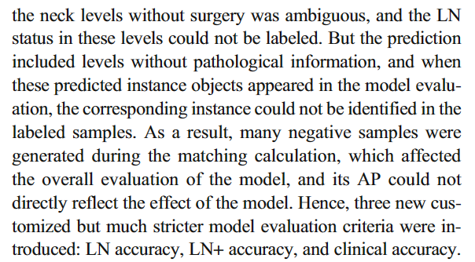

# CT

 background-color: rgb(146 171 116); opacity: 0.3;

### 基本概念

#### **1 像素（Pixel）和体素（Voxel）**

像素（Pixel）是构成图像的基本单位，即图像可被分解成的最小的独立信息单元。因为图像是二维的，所以像素也是没有“厚度”概念的，其最大特点就是一个二维的概念。体素（Voxel）是指像素所对应的体积单位，与像素不同点在于，体素是一个三维的概念，是有厚度差别的，图像所对应的层厚就是体素的“高度”。

#### 2 **矩阵（Matrix）**

每幅图像都有数目不同的像素所构成，像素的多少通常用矩阵来表示，它是指构成图像的矩形面积内每一行和每一列的像[素数](https://so.csdn.net/so/search?q=素数&spm=1001.2101.3001.7020)目，如256 * 256，512 * 512等。在视野大小相同情况下，矩阵数目越大，像素就越小，图像则越清晰。

CT图像矩阵的数目在行和列的两个方向上常是相同的，但在其他类型图像中也可以不同，如192*256的图像矩阵也是可以的。

#### 3 **CT值（CT value）**

由CT的原理已经知道，不同各种组织对X线有不同的衰减系数μ。但是在临床使用中，为了比较方便，不直接使用衰减系数而是采用不同组织相对于水的衰减系数的比值关系。对于组织M的CT值的计算公式如下：

通过上表可以看出，组织密度越大，CT值越高。通过CT值，我们可以量化组织的X线吸收系数，反映不同组织的密度差别；一旦某种组织发生病变，可以通过病变CT值的测量，辅助判断病变成分与性质。但需要指出的是，CT值并不是恒定不变的，会因X线硬化、电源状况、扫描参数、温度和邻近组织等因素发生改变，因此要在诊断中做出合理的判断。 

 

#### 4 **窗宽（Window Width, WW）和窗位（Window Level, WL）**

通过CT值的概念，已经知道人体组织的密度差别较大：肺部含有大量的空气，CT值接近-1000；骨骼含有密度很高的矿物质，最高的CT值接近+1000，这样CT值的变化范围仅不计小数点以下，就有2000个HU的变化（图1-14）。人眼所能够分辨的显示器上的灰阶变化大致在128个左右。为了提高对较小密度差别间组织的分辨能力，在CT图像的显示过程中引入了窗技术，即通过窗位和窗宽的设置，有针对性地观察特定的部位和组织，突出感兴趣结构在图像中的对比和层次。 

窗宽（WW）是指为最佳地显示所感兴趣结构而设置的CT值范围，该范围上下的CT值均以完全白或黑的色调显示，即该范围以外的CT值差别在图像上将无法显示。窗宽范围的中点即所谓的窗位（WL），通常它应是对应于最佳显示兴趣结构的CT值，用来设置为窗宽的中心。例如，脑实质的CT值约为35HU左右，大多数颅内病变CT值的变化在 -30至 +100HU范围内。所以头窗的窗位选择在35~ 40HU，窗宽范围选择在80~100HU左右（具体数值会因设备和习惯不同稍有差别），这样的头窗设置有利于脑实质的观察。而对于颅骨的观察，就要选择骨窗，窗位700 HU，窗宽2000 HU左右。 

在CT图像中，若减小窗宽范围，会突出不同组织间的差别，图像的反差加大，但看起来较粗糙。这样做的好处是，密度差较小的病灶由于增大反差变得容易发现，如在肝脏的检查中，可适当减小窗宽有利于较低密度差别病灶的检出；而另一方面，如果加大窗宽，图像的反差会减小，层次会丰富些，图像看起来较柔和，但是密度差别较小的病灶不易观察。在腹部CT检查时，适当放宽窗位，则可以使腹部的脂肪和气体的密度有所区别。在临床工作中，应根据具体的情况，恰当地对CT图像的窗宽和窗位加以调整，将能够获得更多的诊断信息。当然这种调整是有限度的。 

#### 5 **分辨力**

图像的分辨力是衡量CT设备图像质量的重要指标，它主要包括空间分辨力、密度分辨力和时间分辨力几方面的内容。 

1．空间分辨力（Spatial Resolution） 

图像中可分辨的邻接物体的空间几何尺寸的最小极限，即影像中对细微结构的分辨能力。图像的空间分辨力与单位面积内的像素数目成正比，像素数目越多则空间分辨力越高。 

2．密度分辨力（Density Resolution） 

图像中可分辨的密度差别的最小极限，即影像中细微密度差别的分辨能力。图像的密度分辨力也与单位面积内的像素数目有关，在其他条件不变的情况下，矩阵数目越大，每个像素的体积越小，所接受的光量子数则越少，密度分辨力越低。 

比较CT等数字化成像设备与普通平片可以发现，CT等设备图像的矩阵数目都有限，CT常用512×512的矩阵，而普通平片的每个像素为很小的银盐颗粒，矩阵数目要远远大于数字化成像设备。这样，数字化成像方式，包括CT、MRI、CR等与传统平片相比实际上是提高了密度分辨力，而降低了空间分辨力。 

3．时间分辨力（Temporal Resolution） 

指单位时间内设备所能最多采集图像的帧数，与设备的性能参数有关，如采集时间、重建时间、显示方式、连续成像的能力等。在进行腹部实质脏器病变的检查过程中，常需进行增强检查，在增强后进行连续快速的多期相扫描，可以获得更多的信息。因此，设备的时间分辨力，即设备的扫描速度和连续扫描能力对于运动器官和体部脏器的检查是至关重要的。 

#### 6 **部分容积效应（Partial Volume Phenomenon）**

在层面成像方式中，如同一层面内含两种以上不同密度的物质，两物质在同一层面内横行走行并互相重叠，即当同一个体素内含有两种以上组织成份时（图1-15），该体素的CT值不能反映任何一种物质，实际上是各种组织CT值的平均。例如当一个体素内同时含有骨骼和肌肉，其CT值可能与肌肉类似，但实际上该体素内并不含有肌肉组织的成分。**因此，在高密度区内的小低密度病灶的CT值常偏高，而在低密度区内的小高密度病灶的CT值常偏低。这点在临床观察时一定要注意。** 

 

#### 7 **重建(reconstruction)、回顾性重建(retrospective reconstruction)和重组(reformation)**

重建(reconstruction)是将CT扫描中检测器所采集的原始数据(raw data)经过特殊的数学算法，如反投影法或傅利叶法等计算得到扫描（横断）层面内每个体素的CT值或密度值，形成所需要的数字矩阵与（横断面）CT图像。 

回顾性重建(retrospective reconstruction)是指为了更好地显示图像的细微结构，对扫描所得的原始数据(raw data)再次有针对性地进行重建，改变和选择最佳的视野大小，视野中心和矩阵数目，根据需要选择特定的算法，如骨、软组织、细节或标准等，多层螺旋CT还可以改变再次重建图像的层厚和层数，从而提高组织间的密度分辨力，使图像更加清晰、细致、柔和，提高对细微结构的敏感性。常用在颞骨内听骨链、肺内结节或细微结构以及垂体病变的显示。 

重组(reformation)是指对已经重建好的横断面CT图像，通过计算机技术对全部或部分的扫描层面进行进一步后处理，采用不同的方向和不同的显示技术，多角度、多方式立体地显示解剖结构和病变范围，常用的后处理重组方式包括多平面重组、表面遮盖显示、容积再现和仿真内窥镜等。这些不同的显示技术可以弥补CT横断面显示的不足，从不同方向，直观、立体显示解剖结构或病变形态。 

#### 8 **螺距（Pitch）**

螺旋CT出现以后，由于采用了新的扫描方式的重建算法，在扫描过程中球管每旋转一周床所移动的距离不一定与层厚相同，检查床移动的距离可以等于、小于或大于层厚。为了衡量检查过程中检查床移动的快慢，设定了一个评价指标——螺距，最初它定义为球管旋转一周床所移动的距离与层厚或准值器宽度的比值。在单层螺旋CT设备中，层厚与准值器宽度都是相同的，因此无论采用哪个都是相同的。 

随着多层螺旋设备的出现，特别是还有4层、16层乃至64层等不同的CT设备，层厚与准值器宽度在上述设备间有很大的不同。为了使螺距的指标在不同类型的设备间能够进行方便的比较，螺距重新定义为： 

螺距=每360º床移动的距离/准值器宽度 

这样，无论在哪种类型的CT设备，典型的螺距值都位于0~2之间。如果在

扫描过程中增大螺距，采用螺距大于1的扫描方式，即移床的距离大于准值器宽度，扫描速度将得到提高但图像质量会下降；如减小螺距，采用螺距小于1的扫描方式，即移床的距离小于准值器宽度，扫描速度虽减慢但图像质量会改善。

#### 9 **团注(Bolus Injection)**

团注是指快速向血管内注入对比剂，单位时间内注射的速度要略高于同时期内该血管的血流量，这样可以使局部血管内的血液全部被注射的对比剂所置换。通过采用团注的注射方式，使动脉中的对比剂浓度在很短的时间内就可以达到峰值，从而可以更好地观察病变的强化行为和特点，避免由于注药时间过长，静脉等所可能造成的干扰。

#### 10 **伪影（Artifact）**

伪影是指由于扫描时的实际情况与重建图像过程的一系列假设不一致，所带来图像与实际情况不符合的现象。CT中常见的伪影有以下几种：

①移动伪影：扫描时由于患者的运动可产生移动性伪影，一般呈条状低密度影；

②线束硬化伪影：当X线穿过高密度结构或物质，如枕骨粗隆、牙齿、术后银夹等后，会造成X线穿透特性的改变，从而在以后的计算和重建过程中引起衰减计算的错误，可呈放射状或条带状的高密度或低密度影；

③机器故障伪影：这种伪影的原因和类型很多，如检测器工作不正常可造成环形或同心圆状的伪影。

https://blog.csdn.net/a8039974/article/details/108545246

## Baseline

医生给出ROI

随机抽取n例 CT 图像，ICC检验

提取feature ICC检验

确定体素大小

## 诊断

### Distinguishing common renal cell carcinomas from benign renal tumors based on machine learning

基于机器学习的普通肾细胞癌与良性肾肿瘤鉴别

#### 概述

使用 CatBoost 进行特征选择和 ML 模型建立。使用 ROC曲线曲线下面积(AUC)来评估 ML 模型的性能。结果**基于三维图像的 ML 模型比基于二维图像的 ML 模型表现更好**

三位放射科医师通过参考分类器的决策，均取得了较好的效果，准确率从0.82提高到0.87，从0.82提高到0.88，从0.76提高到0.87

#### 亮点

- 基于 CT 图像的机器学习分类器可能是区分肾癌和良性肾肿瘤的可靠方法。
- 机器学习模型完美地补充了放射科医生的解释。
- ROI 描述中的细微差异对 ML 分类器的性能影响不大

#### 影像筛选

病理诊断再次确认的病理学家与10年的经验。

纳入标准如下:

1. 术前 CT 三期扫描
2. 病理证实的原发病变

排除标准如下: 

1. 显着的病灶破裂，大量出血导致肿瘤特征模糊;
2. CT 研究中造影剂注射后不正确的延迟时间;
3. 完全由囊性成分组成的病灶; 
4. 造影前期(PCP) CT 上有可见脂肪的病灶。

#### 图像处理

图像预处理步骤包括标准化、像素重采样和离散化，

使用 z 评分进行图像标准化。

离散化是将连续的特征分类为离散的特征值; 离散化的一个典型应用是**灰度图像的二值化**。在我们的研究中使用了25个箱宽的离散化

##### 存疑

重采样时体素大小定义为**0.8 × 0.8 × 0.8 mm**。**像素重采样可以提高模式的精度和总体参数估计，包括上采样和下采样。**

#### 肿瘤分割

医生手动分割

#### 特征提取

#### 讨论

**对于cnn来说，较小的病灶可以提取较少的特征，使得鉴别更加困难。然而，我们发现 ML 模型的性能仍然是可以接受的。**在常规图像解释中，对于小于3厘米的偶发性肾脏肿瘤作出准确的诊断比对于较大的肾脏肿瘤作出准确的诊断更为重要和困难

**肿瘤边缘缩小/扩大1毫米或3毫米对模型没有显著影响。我们假设随后由于肿瘤边缘的轻微变化而丢失或增加的特征包括从整个肿瘤中提取的所有特征的一小部分;** 换句话说，我们实际获得的特征足以估计肿瘤的同质性或异质性。因此，在类似的研究中，我们可能不必过分关注 ROI 描述中的细微差异。

为了解决不平衡数据集对分类器性能的不利影响，从最优特征的联合加权出发，采用合成少数过采样技术(SMOTE)生成少数群体样本。**然而，由于这些算法不可避免的过度拟合，SMOTE 生成的统计数据不太真实。**不平衡的数据在一定程度上反映了肾脏恶性肿瘤和良性肿瘤的真实发生率。此外，本研究只使用了一种算法来建立最大似然，这也是一个潜在的弱点。因此，需要进行大规模、多中心、多算法的研究来进一步验证我们的研究（加工作量？）

### Deep learning–assisted diagnosis of benign and malignant parotid tumors based on CT

基于CT的腮腺良恶性肿瘤的深度学习辅助诊断

#### 概述

#### 亮点

- 所建立的深度学习模型在预测腮腺良恶性肿瘤方面优于传统的 SVM 模型。
- 初级放射科医师可在最佳深度学习模式的协助下，获得更大的临床效益。
- 使用已建立的深度学习模型可加速腮腺肿瘤患者的临床决策过程。
- 虽然之前研究取得了令人满意的诊断性能，但它们受到样本量小和缺乏外部验证的限制。本研究的目的是开发和验证多中心数据集上的最佳深度学习模型

#### 队列*

两个中心招募了573例经组织病理学证实的 BPT 和 MPT 患者(图1)。

纳入标准如下: 

1. 患者有完整的影像学和临床资料;
2. 手术前30天内 CT 增强扫描;
3. CT 检查前未进行治疗。

排除标准如下: 

1. 肿瘤复发患者; 
2. CT 图像伪影明显;
3. **肿瘤最大直径小于10mm。**（这是为什么）

最终队列包括来自中心1的385名患者，其中包括266名 BPT 患者和119名 MPT 患者，以及来自中心2的188名患者，其中包括130名 BPT 患者和58名 MPT 患者(组织病理学类型和数量见补充表 S1)

#### 分割方法

##### baseline

使用动脉期放射学特征结合腮腺肿瘤的临床放射学特征来构建支持向量机模型作为基线模型

在动脉期 CT 图像上**手动**绘制肿瘤轮廓来获得肿瘤分段的3D 体积(VOI)。通过随机抽取30例 CT 图像，**计算组内相关系数(ICC)** ，评价放射学特征的重复性。

##### icc检验：

ICC常用于衡量某个指标（比如，皮层厚度）在多次测量中的一致性/相似性（即信度）。在概念上，ICC等于真实的（被试间）变异除以观测的变异，观测的变异等于真实的变异加上噪声变异。比如，ICC=0.5表示真实变异和噪声变异相同。ICC越高，表明观测/测量越可靠。ICC的理论范围在0-1，一般地，ICC位于0-0.5之间表示信度差，0.5-0.75表示中等，0.75-0.9表示好，0.9-1表示极好（也存在其他分类标准）。

链接：https://www.jianshu.com/p/b7a35808c0ac

#### 特征提取

使用 PyRadiomics 3.0.1版进行图像预处理和特征提取，**并将所有图像重采样到1 × 1 × 1mm3的体素间距**。同时，采用25 Hounsfield 单元(HU)的固定仓宽进行灰值离散化。总共为每个肿瘤提取了**851个放射组学特征**

使用 Mann-Whitney U 检验(p < 0.05)初步筛选 ICC > 0.75的放射学特征。所有的放射组学特征使用 z 分数标准化，然后进一步筛选最小绝对收缩和选择算子(LASSO)。采用合成少数过采样技术(SMOTE)算法以1:1的比例平衡训练集中的少数样本。使用敏感性、特异性、准确性、阴性预测值(NPV)、阳性预测值(PPV)和 ROC曲线曲线下面积(ROC)来评估模型的预测性能。

#### DL

所有2D 矩形感兴趣区域(ROI)根据肿瘤的3D 分割掩模从原始 CT 图像一片一片地切片

 ImageNet 数据集上预先训练以获得初始权重值

并对所有图像进行 z 评分归一化

随机水平翻转和裁剪的动态数据增强技术。

SGD优化器，初始学习率为0.01，余弦退火算法衰减，共计200个纪元，1800个迭代步骤，批量大小为128。

Grad-CAM可视化。利用神经网络最后一个卷积层

#### 讨论

BPTs 通常采用保留面神经的浅表腮腺切除术治疗，而 MPTs 采用更积极的方法进行根治性腮腺切除术，甚至面神经切除术或术后放疗[2]。USCBs 和 FNA 可能伴有一些严重的并发症，因为它们是侵入性操作[4,5] ，常规的视觉评估往往由于不同类型的腮腺肿瘤之间重叠的放射学特征而混淆。一些先进的 MRI 技术提高了术前诊断的准确性，但在很大程度上取决于放射科医师的专业经验和专业知识，这反映在我们的放射科医师在测试组中具有不同水平的经验。相比之下，机器学习在分类任务中比放射科医师的肉眼评估具有更明显的优势，利用医学图像中特征的强大学习来维持诊断的一致性和可重复性[29]。目前，传统的基于 CT 或 MR 图像的机器学习方法已被用于研究

尽管模型性能令人满意，**但没有一个相关的研究在大样本的外部测试集上验证其模型的普遍性。**在我们的研究中，SVM 模型在外部测试集中的灵敏度仅达到0.621，表明其基于手工特征的普遍性相对较差，这可能与不同 CT 设备与各种协议的这些特征的可重复性有关[31-33]。相反，深度学习可以实现端到端的分类和预测，而不需要通过直接从输入图像的原始像素自动学习复杂的特征来手动设计硬编码特征提取[20,21,34]。在 Gunduz 等人的研究中，应用基于多参数 MRI 的 InceptionResNetV2模型对 BPTs 和 MPT 进行分类，准确度为0.921[16] ，而基于多模态 MRI 的另一项端到端深度学习研究的结果显示，该模型仅在腮腺 Warthin 肿瘤和多形性腺瘤之间具有良好的区分性[15]。Zhang 等报道，在基于 CT 图像的 BPTs 和 MPT 分类中，改进的深度可分离 CNN 超过了其他四种经典 CNN (Inception V3，DenseNet 121，ResNet 50和 VGG 16)[17] ，这与我们的发现一致。与这些研究相比，**我们纳入了迄今为止最大的样本量，并为模型验证提供了一个独立的外部测试集。**

##### 局限

这项研究有几个局限性。

首先，在辅助系统应用于实际临床之前，这项回顾性研究应在进一步的前瞻性临床试验研究中得到验证。

其次，我们只考虑了 BPT 和 MPT 的鉴别诊断，而没有进一步的分型。

第三，我们开发的深度学习模型没有纳入一些有价值的临床信息，如淋巴结转移; 我们计划调查是否可以进一步提高模型的性能，纳入这些信息在未来的研究。

第四，基于 ML 的模型开发在医学领域的未来似乎涉及多放射组学和多模态成像的结合; 

然而，由于我们的研究的回顾性设计，我们没有建立这种基于美国，CT 和 MR 图像的腮腺肿瘤患者的组合模型，这个问题将是我们未来研究工作的一个重要方向

### Artifcial intelligence–based prediction of cervical lymph node  metastasis in papillary thyroid cancer with CT

基于人工智能的颈部淋巴结预测甲状腺乳头状癌转移的CT表现

#### 概述

#### 分割方法

手动分割

## 分割

### 主要类别：

#### unet

D-UNet

**[UCTransNet](https://github.com/McGregorWwww/UCTransNet)**

mask rcnn

~~yolo8~~

maskFormer

### 数据增强方式：

通过对可用的训练图像应用弹性形变来使用过度的数据增强，因为形变图像组织结构中最常见的变化，可以模拟其他真实数据。在3x3网格上的随机位移向量生成平滑变形。位移从具有10个像素标准偏差的高斯分布中采样。然后使用双三次插值计算每像素位移。收缩路径末端的退出层执行进一步的隐式数据扩充。

### paper

#### Deep learning assisted CT–based diagnosis of cervical lymph node metastasis of oral cancer

深度学习辅助ct诊断口腔癌颈部淋巴结转移

##### 概述

##### 亮点

- 现代医学影像学工具对淋巴结转移没有很好的认识。
- 迁移学习可以提高深度学习模型预测的准确性。
- 深度学习有助于准确识别淋巴结转移
- 样本量大
- 对结节分级
- 研究内容为 CECT，具有很强的普遍性和适用性，符合中国国情。FDG PET/CT 比 CT/MRI 能更好地检测颈部隐匿性转移。然而，这种方法是昂贵的，只有少数大型医院配备这样昂贵的机器。
- 数据集好，有全分割数据集，然后在全分割上学习分割能力，然后在训练分类能力
- 

不知道这个radiology department怎么得出来的（医生和学生的平均水平？）

##### 队列

对于1466个样本：

**选择5412幅图像进行全层数据标记(阶段 I)** 

第一阶段旨在自动识别宫颈 CECT 图像中的不同软硬组织，特别是区分和识别 LN，希望在下一阶段的训练中实现 LN 更准确的识别和定位。

**选择5601幅图像进行淋巴结转移鉴别数据标记(阶段 II)**

II 期设计用于准确区分淋巴结转移。LN- 和 LN + 被特异性标记(图2)。共筛选了5601个 CECT 图像，其中2126个是 LNs + ，涉及1667个图像，6140个是 LNs-，涉及3934个图像(图1)

使用联合癌症委员会第八版 TNM 分类(TNM8)标准 IQR 四分差

##### 分割方法

Mask R-CNN, Resnet101，FPN 

##### 训练方式有点奇特

在我们的研究中，数据集被重组并分为训练(60%) ，验证(30%)和测试集(10%)。对于模型训练，我们使用掩码 R-CNN COCO 模型权重作为初始权重，并通过随机梯度下降(SGD)策略进行优化。在第一阶段，模型在训练集上总共训练了50个epoch，并在验证集上的每个epoch之后进行验证。

在第二阶段，以淋巴结转移鉴别标记数据(通过旋转和镜像放大)作为数据集。第二阶段模型(没有 TL)总共训练了100个纪元。损失的趋势如图所示。随后，采用训练结果的第一阶段模型作为 TL 的初始模型权重，以提高训练效果。然而，阶段 II-TL 模型(含 TL)总共训练了10个epoch。损失的趋势如图所示。S3e，f.在训练过程中，每个epoch后计算验证损失，每个时代后保存模型权重，验证损失有所改善。

用了transfer learning后初始loss小，10epoch就降下

##### 没看懂

没有手术的颈部水平模糊不清，这些水平的 LN 状态无法标记。**但是预测包含了没有病理信息的水平，当这些预测的实例对象出现在模型评价中时，相应的实例在标记样本中无法识别。因此，在匹配计算过程中产生了大量的负样本，影响了模型的整体评价**，其 AP 值不能直接反映模型的效果。因此，三个新的定制但更严格的模型评价标准被引入: LN 准确性，LN + 准确性和临床准确性。

##### 跟医生比较

##### 颈部分级

The neck is divided into a total of seven levels based on the topographical subdivision 

##### 代码链接

Our networks were constructed based on the Mask RCNN framework, and the code for the Mask R-CNN framework we referenced can be downloaded from the GitHub repository https:// github.com/facebookresearch/Detectron and https://github.com/ matterport/Mask_RCNN. Our data-labeling platform was deployed based on the privatization of the open-source data–labeling platform Label Studio at https://github.com/heartexlabs/label-studio. We trained on a computer with an NVIDIA V100 GPU, and the codes we used for training are available at the GitHub repository https://github.com/ whucsss/LNdiagnosis-stage1 and https://github.com/whucsss/ LNdiagnosis-stage2

#### Automated lung cancer assessment on 18F-PET/CT using Retina U-Net and anatomical region segmentation

基于视网膜的18F-PET/CT自动肺癌评估U-Net和解剖区域分割

##### 概述

#### D-UNet: a dimension-fusion U shape network for chronic stroke lesion segmentation

## 分割+诊断

### 2021

#### Theranostics-12.4-2021-Fully end-to-end deep-learning-based diagnosis of pancreatic tumors

##### 概述

##### 数据集

所有患者术前均行腹部 CT 增强扫描。两家医院都使用了两种不同的扫描仪: 第一种使用64层和256层 CT (飞利浦保健) ，第二种使用40层新型双源 CT (西门子公司)和320层 CT (东芝医疗系统公司)。两个机构使用相同的 CT 扫描参数: 120kVp 管电压，125-300mAs 管电流，0.6-1.25 mm 节距，3-5mm 切片厚度和3-5mm 重建间隔。经验丰富的放射科医生使用 Adobe PhotoShop 软件标记出胰腺在 CT 扫描动脉期的位置，并将患者分为有无胰腺癌。

##### 数据提取&增强*

为了有效地扩大我们的训练数据集以提高所提出模型的鲁棒性，我们进行了四个数据增强操作: 随机设置范围内的亮度(-0.8,0.8) ，随机设置范围内的对比度(-0.8,0.8) ，随机弹性变换与 α 仿射为30，随机裁剪至450 × 450像素，然后调整为512 × 512像素。然后用来自265名肿瘤患者的90,194幅图像和来自82名对照患者(216名男性和131名女性，年龄范围24-88岁，平均61.8岁)的16,842幅图像的独立数据集测试该模型。

###### 春秋笔法

筛选原始数据都算创新？

从医院获得的原始病人数据包括多个文件。然而，现有的方法侧重于包含胰腺的 CT 图像的分析，而**忽略了在早期阶段筛选原始数据的重要性**，如图1A 所示。该模型首先筛选出包含胰腺的横断面 CT 图像，然后进行深度学习诊断

数据集是复杂的，具有三个重要特征: 文本报告(CT examination diagnosis reports and patient 
protocols) ，不同的成像平面(冠状，矢状和横向)和不同的血管造影阶段(动脉，静脉和延迟或门静脉阶段)。为了控制图像质量，筛选只选择包含胰腺的横断面 CT 图像。数据集中的每个图像都包含诸如“患者姓名”、“图像形状”和“系列描述”等属性。该模型根据“图像形状”为512 × 512，“系列描述”为“动脉期”、“静脉期”或“延迟期”来筛选图像。考虑到扫描仪的不同规格，我们**增强了图像的对比度，然后将其归一化为0-255**（不需要标准化？？？），以突出胰腺结构并增加 FEE-DL 模型的通用性。

##### 网络架构

###### 定位

ResNet18用于识别包含胰腺的图像。

###### 分割

Unet32

###### 识别

ResNet34被用来诊断胰腺癌的存在
