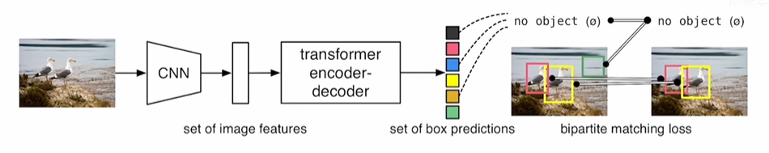
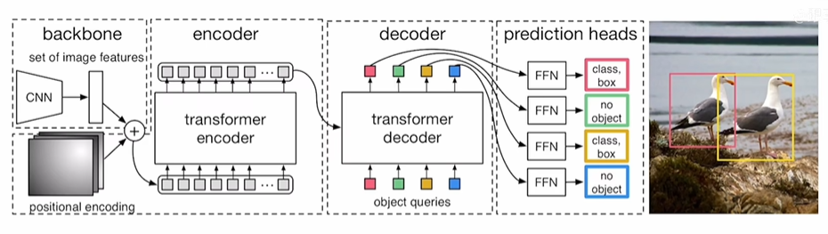
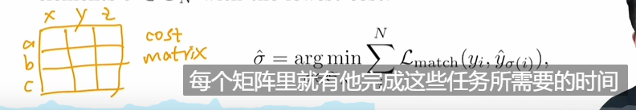
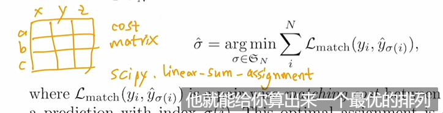
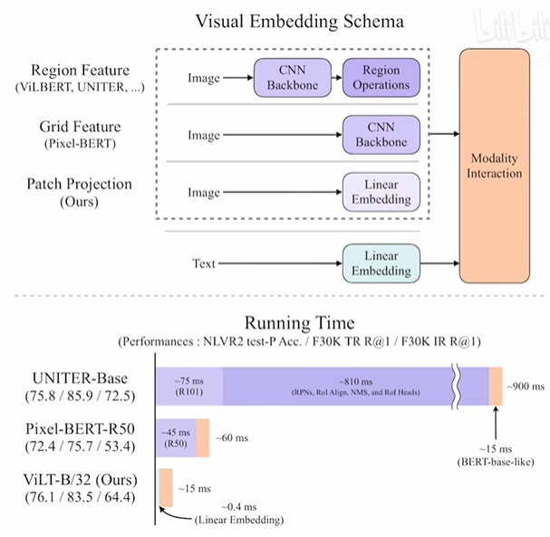
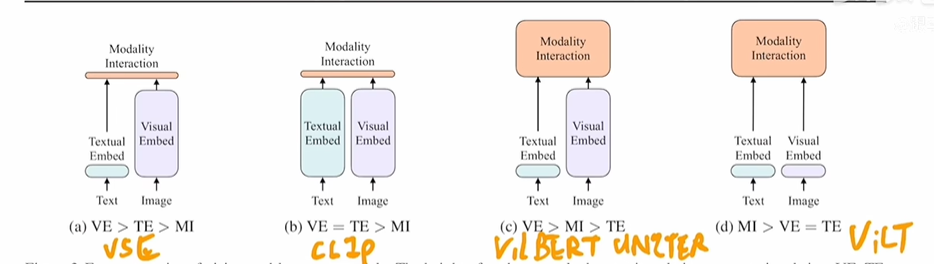
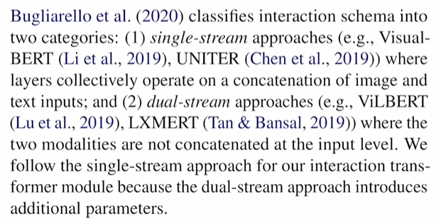
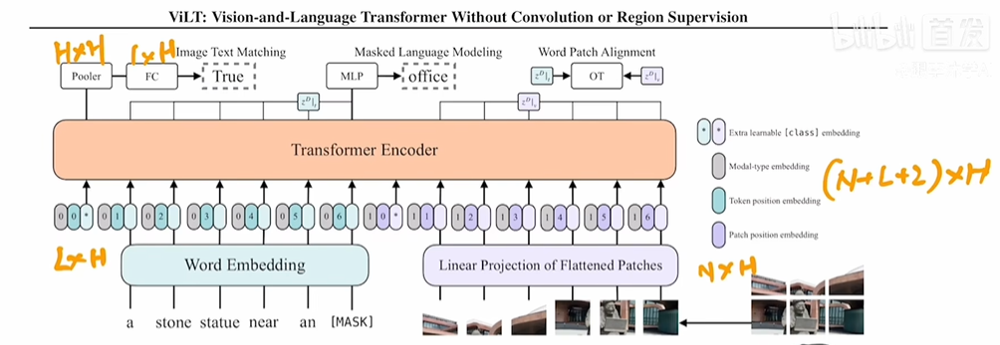
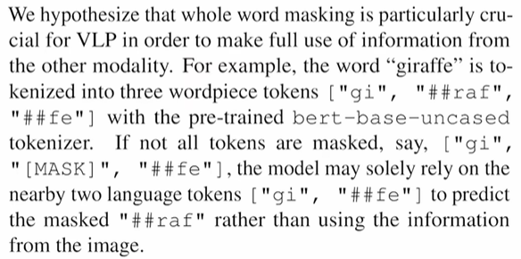

# Transformer

## object detection

### DETR

object queries做自注意力主要是为了移除冗余框，因为通过注意力机制互相通信后，就可以知道每个query会得到一个什么样的框，而互相之间不要去做重复的框。

细节：

在decoder的每层都

loss

最优二分图匹配

### ViLT

精确度可能还不够，但是速度快了上千倍

