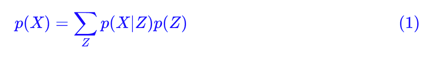
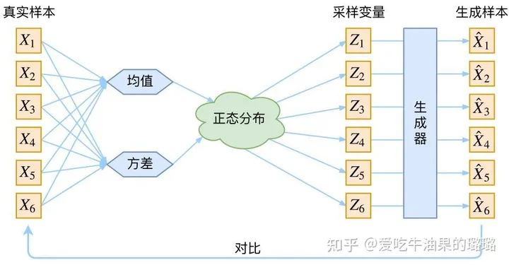
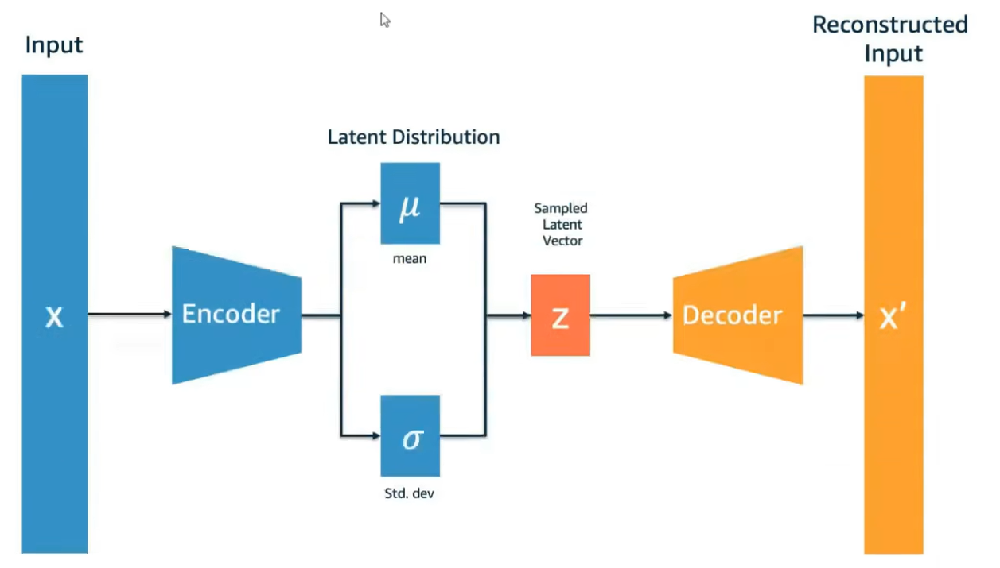
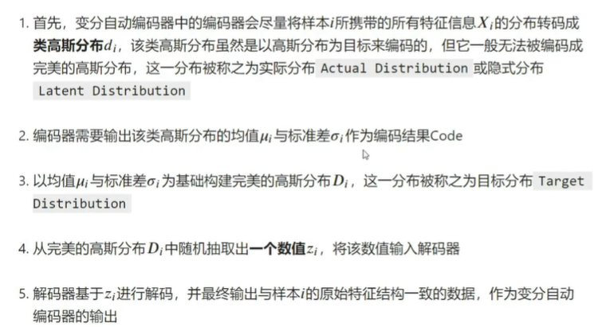
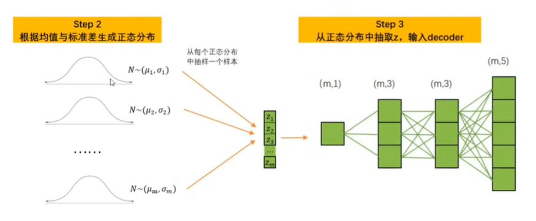
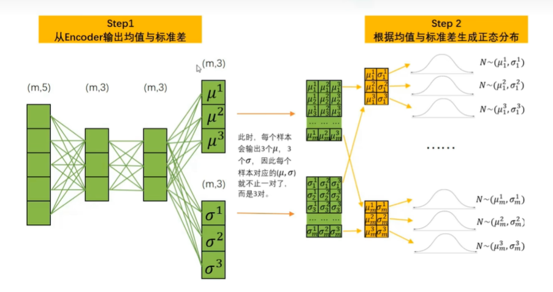
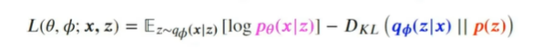

# 变分自编码器

首先我们有一批数据样本 {X1,…,Xn}，其整体用 X 来描述，我们本想根据 {X1,…,Xn} 得到 X 的分布 **p(X)**，如果能得到的话，那我直接根据 p(X) 来采样，就可以得到所有可能的 X 了（包括 {X1,…,Xn} 以外的），这是一个终极理想的生成模型了。（因为不知道是什么分布，没法用公式来拟合）

当然，这个理想很难实现，于是我们将分布改一改：

这里我们就不区分求和还是求积分了，意思对了就行。**此时 p(X|Z) 就描述了一个由 Z 来生成 X 的模型，而我们假设 Z 服从标准正态分布，也就是 p(Z)=N(0,I**)。如果这个理想能实现，那么我们就可以先从标准正态分布中采样一个 Z，然后根据 Z 来算一个 X，也是一个很棒的生成模型。

其实，**在整个 VAE 模型中，我们并没有去使用 p(Z)（先验分布）是正态分布的假设，我们用的是假设 p(Z|X)（后验分布）是正态分布**。

具体来说，给定一个真实样本 Xk，我们假设存在**一个专属于 Xk 的分布 p(Z|Xk)**（学名叫后验分布），并进一步假设这个分布是（独立的、多元的）正态分布。

因为我们后面要训练一个生成器 X=g(Z)，希望能够把从分布 p(Z|Xk) 采样出来的一个 Zk 还原为 Xk。

https://zhuanlan.zhihu.com/p/432792540

样本集合X不符合正态分布，因此需要一个F(z)来拟合这个分布，而这个z符合**标准**正态分布，所以这个z由图像x输入网络生成的均值和方差来决定。

那等于说，一个图像，它的每一个像素点都有一个属于该像素点的分布，512*512的图像就有262144个分布 。

### Loss

前面这个期望是为了减小重构误差

KL散度是希望拟合分布逼近真实分布