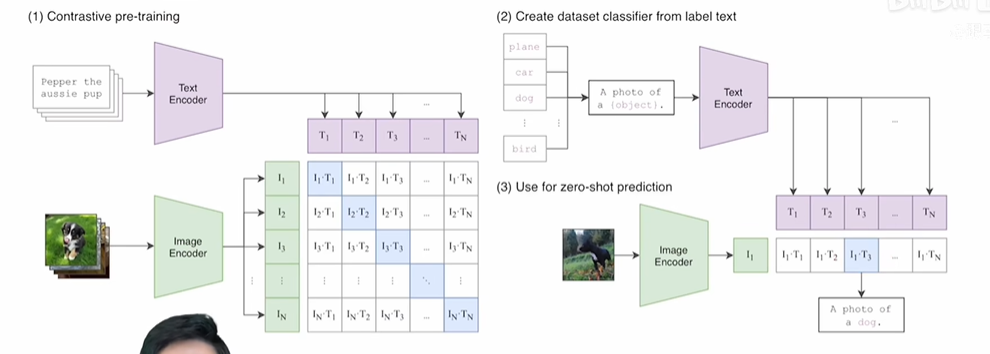
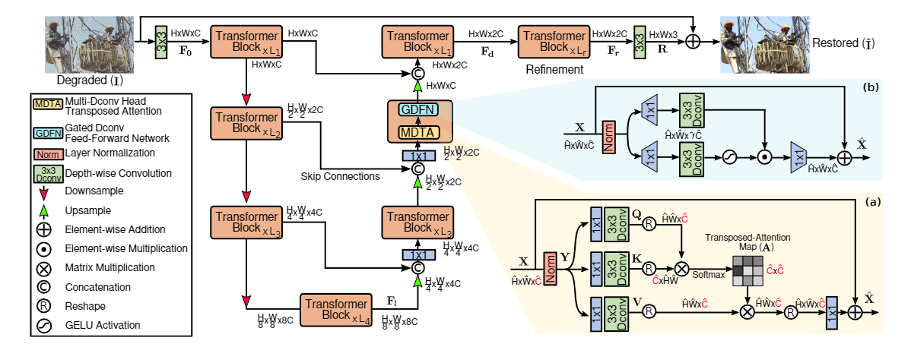
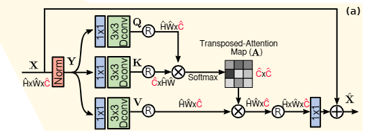
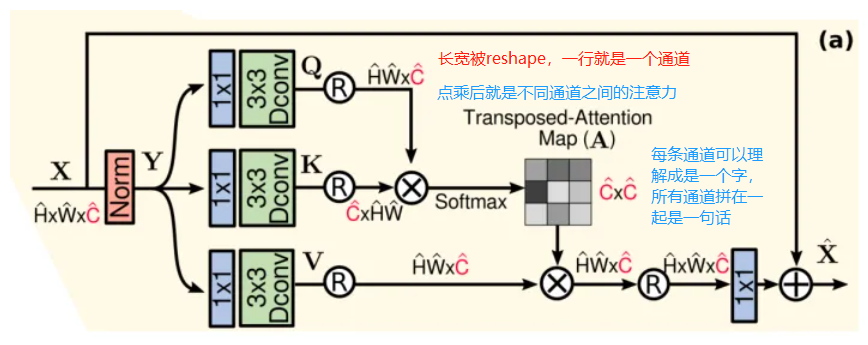
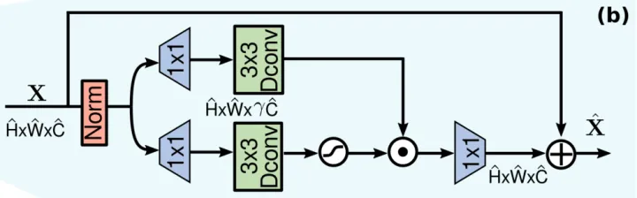
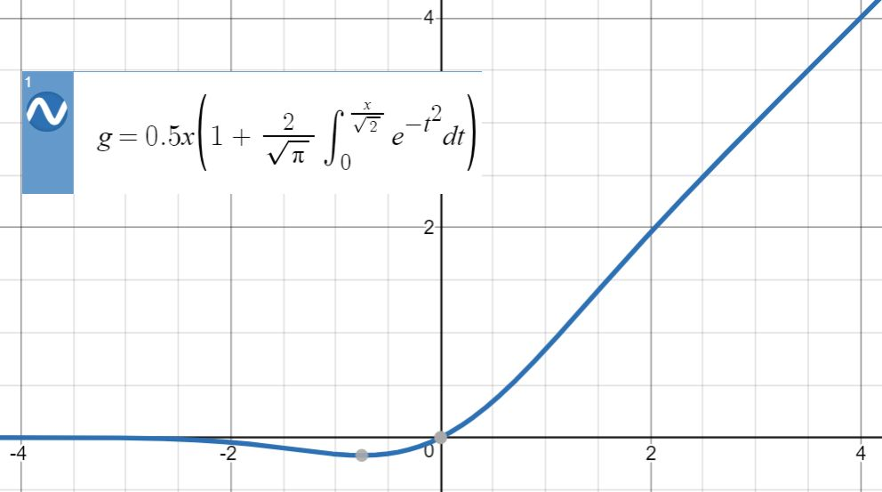
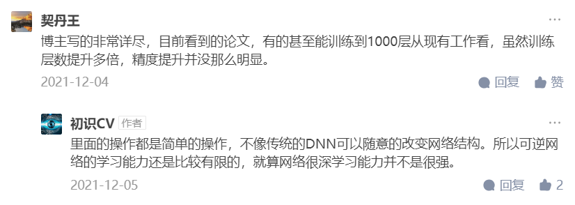
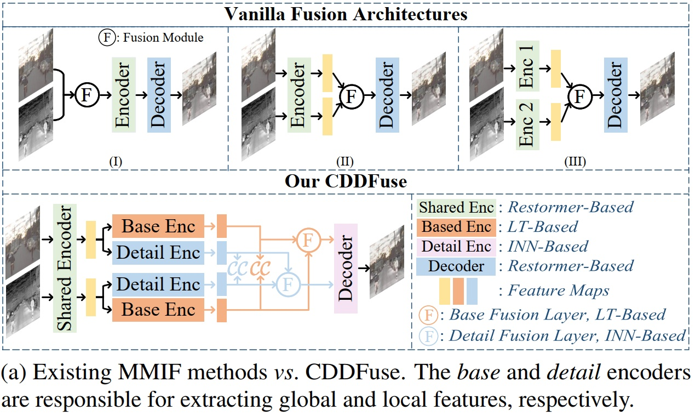
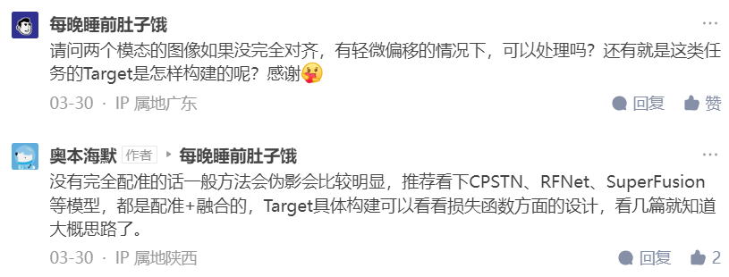

# 多模态

## Restormer

Efficient Transformer for High-Resolution Image Restoration

Restormer:用于高分辨率图像复原的高效Transformer

### 待解决问题：

在 CNN 中，其基本操作是“卷积”，它为 CNN 提供了局部连接和平移不变性的特性。 虽然这些特性为 CNN 带来了效率和[泛化](https://so.csdn.net/so/search?q=泛化&spm=1001.2101.3001.7020)性，但它们也产生了两个主要问题：

- 卷积算子的感受野有限，无法对长距离像素依赖性进行建模；
- 卷积滤波器在推理时具有静态权重，不能灵活地适应输入内容。

Self-Attention在捕获长距离像素相互作用方面非常有效，但其复杂性随着空间分辨率的增加呈平方增长，因此无法应用于高分辨率图像(图像恢复中常见的情况)

为了减少计算量，这些方法:

- 要么在每个像素周围大小为8×8的小空间窗口上应用SA
- 要么将输入图像划分为大小为48×48的不重叠的patch，并在每个patch上独立计算SA。

然而，限制SA的空间范围与捕捉真正的长距离像素依赖的目标是矛盾的，特别是在高分辨率图像上。

### 解决方案：

1. 引入了一个多Dconv头“转置”注意力(MDTA)块

   - 多头Dconv转置注意力

     

     关键是跨通道而不是空间维度应用SA，即计算跨通道的交叉协方差，生成隐式编码全局上下文的注意力图。

     **[应用1×1 point-wise 卷积来聚合像素级跨通道上下文，然后应用 3×3 depth-wise 卷积来编码通道级空间上下文](https://zhuanlan.zhihu.com/p/80041030)**

     

2. 前馈网络由两个全连接层组成，层之间具有非线性映射关系。重新制定了正则FN的第一线性转换层，采用门控机制来改善网络中的信息流。该门控层被设计为两个线性投影层的元素乘积，其中一个是由GELU非线性激活的。

   

   - 在本文中，作者进行了两个改进：

   - - gating mechanism——门控机制

     - - 被表示为线性变换层的两条平行路径的元素级乘积，其中一条通过 **[GELU非线性激活](https://zhuanlan.zhihu.com/p/349492378)**

   

   - - depth-wise convolutions

     - - 在这里依然使用了 depth-wise convolution，以对空间相邻像素位置的信息进行编码，这有助于学习局部图像结构以进行有效恢复

## INN(invertible neural network)

多伦多大学的Aidan N.Gomez和Mengye Ren提出了[可逆残差神经网络](https://link.zhihu.com/?target=https%3A//arxiv.org/abs/1707.04585)，**当前层的激活结果可由下一层的结果计算得出，也就是如果我们知道网络层最后的结果，就可以反推前面每一层的中间结果。这样我们只需要存储网络的参数和最后一层的结果即可，激活结果的存储与网络的深度无关了，将大幅减少显存占用。**令人惊讶的是，实验结果显示，可逆残差网络的表现并没有显著下降，与之前的标准残差网络实验结果基本旗鼓相当。

如果直接用传统神经网络去训练逆向过程，则效果会很受限，因为逆向过程为一对多映射。神经网络训练出的模型，最好情况是识别最可能的解决方案；最差情况是采用多种解决方案的平均值。

INN 有三个特征：（i）从输入到输出的映射是双射的，即它的逆存在（ii）正向和反向映射都是有效可计算的（iii）映射具有易处理的雅可比行列式，因此概率可以通过变量公式明确转换。

标准NN v.s. INN

标准 NN 直接对逆向过程进行训练，但其需要一个监督损失（SL）项，来区分真正的 x 与预测的 x（我们可以暂时把 SL 理解为一个确定的代价函数），而 y->x 这种一对多映射使得传统 NN 受到很大限制。INN 只对前向过程使用 SL，而由于并没有一个确定的 x 值，因此预测的 x 属于无监督损失（USL），需要遵循之前的 p(x)；另外，潜在变量 z 需要服从高斯分布，也是属于 USL。

由于在前向过程中会丢失一些信息，因此引入了额外的潜在输出变量 z，被训练去抓获与 x 有关的但并未包含在 y 内的信息。此外，需要训练网络根据高斯分布对 p(z) 进行调整。即，p(x|y) 被调整为一个确定的函数 x = g(y,z)，这个函数将已知的分布 p(z) 在满足 y 的情况下转换到 x 空间。
链接：https://www.jianshu.com/p/37c482fe4d2a

## CDDFuse

### 待解决问题：

1. CNN的解释性较差，难以控制，对跨模态特征提取不够充分，如上图a前两种都是多模态输入共享编码器，因此难以提取到模态特有的特征，而第三种双分支结构则忽略了各个模态共有属性；
2. 上下文独立的CNN结构只能在相对小的感受野内提取到局部信息，很难捕获全局信息，因此目前还不清楚 CNN 的归纳偏差能否对所有模态的输入充分提取特征；
3. 网络的前向传播会造成高频信息丢失

### 解决方案：

**本文的假设是对于多模态图像融合，两个模态的输入特征在低频上是相关的，表示了所有模态的共有信息，在高频上是不相关的，表示了各个模态独有的信息。**