## 对比学习

### 自监督学习

自监督学习主要是利用辅助任务（pretext）从大规模的无监督数据中挖掘自身的监督信息，通过这种构造的监督信息对网络进行训练，从而可以学习到对下游任务有价值的表征。（也就是说自监督学习的监督信息不是人工标注的，而是算法在大规模无监督数据中自动构造监督信息，来进行监督学习或训练。因此，大多数时候，我们称之为无监督预训练方法或无监督学习方法，严格上讲，他应该叫自监督学习）

#### SimCSE

不同的drop out认为是正样本

#### CMC

同一个物体的不同视角

#### MOCO

### Loss Function

#### NCE（Noise Contrastive Estimation）

直观想法：把多分类问题转化成二分类。

之前计算softmax的时候class数量太大，NCE索性就把分类缩减为二分类问题。

之前的问题是计算某个类的归一化概率是多少，二分类的问题是input和label正确匹配的概率是多少。

对于每一个训练样本（x, T)，我们训练binary classification，而不是multiclass classification。具体一点，我们对于每个样本，拆分成一个真实的（x,y)pair,另外我们随机产生k个Noise的（x,y）pair,这样我们就可以用来训练处这样的binary classifier。
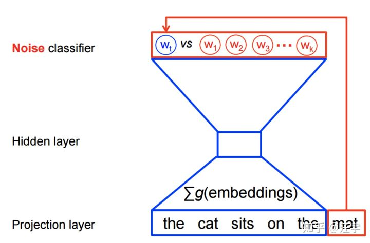

https://link.zhihu.com/?target=http%3A//scholar.sun.ac.za/handle/10019.1/98758

用概率来表示，这个问题由之前的P(y|x) 通过x预测所有y，换成了P(x,y)，计算x,y同时存在的概率。

https://blog.csdn.net/yimingsilence/article/details/105920987

NCE 的**核心思想就是通过学习数据分布样本和噪声分布样本之间的区别，从而发现数据中的一些特性**，因为这个方法需要依靠与噪声数据进行对比，所以称为“噪声对比估计（Noise Contrastive Estimation）”。更具体来说，NCE 将问题转换成了一个二分类问题，分类器能够对数据样本和噪声样本进行二分类

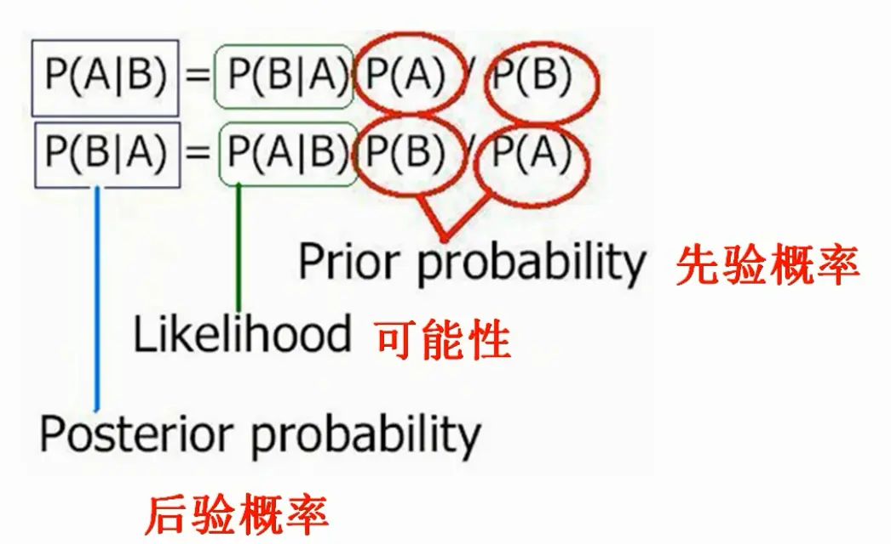

https://www.jianshu.com/p/cb1362ab600a

**先验概率（prior probability）：**指根据以往经验和分析。在实验或采样前就可以得到的概率。

**后验概率（posterior probability）：**指某件事已经发生，想要计算这件事发生的原因是由某个因素引起的概率。

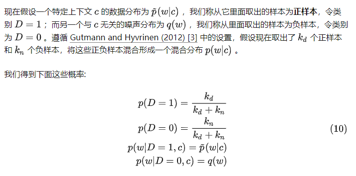

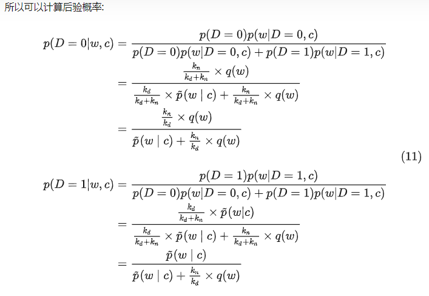

https://zhuanlan.zhihu.com/p/334772391

### Maskformer

### SAM（segment anything）

## 条件概率

作者：石溪
链接：https://www.zhihu.com/question/399801289/answer/2490070028
来源：知乎
著作权归作者所有。商业转载请联系作者获得授权，非商业转载请注明出处。

这个条件概率描述的就是在给定事件 B 发生的情况下，事件 A 发生的概率，我们专门把他记作： P(A|B)P(A|B)P(A|B) 。

那我们回到投掷骰子的问题中来，在投出[奇数点数](https://www.zhihu.com/search?q=奇数点数&search_source=Entity&hybrid_search_source=Entity&hybrid_search_extra={"sourceType"%3A"answer"%2C"sourceId"%3A2490070028})骰子的前提下，投出 5 的概率有多大？奇数点数一共有 {1,3,5 \} 三种，其中出现 5 的概率是 1/3 。很明显，和单独问投出点数是 5 的概率计算结果是不同的。

下面我们来抽象一下条件概率的场景。

我们再回到最简单、最容易理解的情景下来看，即在古典概率的模式下来分析：假定一个试验有 N 个等可能的结果，事件 A 和 B 分别包含 M~1~个和 M~2~ 个结果，这其中有 M~12~ 个结果是公共的，这就是同时发生事件 A 和事件 B ，即 A∩B  事件所包含的试验结果数。

形象的描述一下上述场景，如图所示：

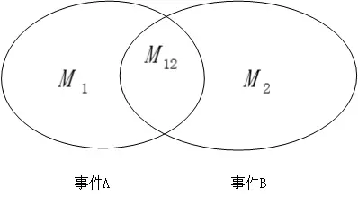

图1.事件发生的描述

那我问你，单纯的发生事件 A 和事件 B 的概率是多少？你肯定是脱口而出，分别是 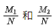 ，那进一步到条件概率中来，已知在事件 B 发生的前提条件下，事件 A 发生的概率是多少？

则此时，我们的整体考虑范围由最开始的 N 个全部的可能结果局限到现在的 M~2~ 个结果，即 B 事件发生的结果范围，而这其中只有 M~12~ 个结果对应事件 A 的发生，那么我们不难计算出，条件概率 

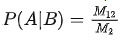

https://www.zhihu.com/question/399801289/answer/2490070028

条件概率公式P(A|B)=P(AB)/PB的意义可以这样理解：在已知事件B发生的情况下，事件A发生的概率是多少。其中，P(AB)表示事件A和B同时发生的概率，PB表示事件B发生的概率。

例如，有一个装有10个球的袋子，其中有4个红球和6个蓝球。现在从袋子中任意取出一个球，A表示这个球是红球，B表示取出的球是蓝球。那么P(B)=6/10=0.6，P(AB)=4/10=0.4。根据条件概率公式，P(A|B)=P(AB)/PB=0.4/0.6=2/3，即在取出的球是蓝球的情况下，取出的球是红球的概率为2/3。

另外，P(AB)不等于P(A) * P(B)，因为事件A和B同时发生的概率可能会受到其他因素的影响，无法简单地等于两个事件各自发生的概率的乘积。

https://www.idongde.com/q/Db4Dfd6038d133f8/a7687829.shtml

## 似然函数

假设一个函数为 aba^{b}a^{b} ，这个函数包含两个变量。

如果你令b=2，这样你就得到了一个关于***a的[二次函数](https://www.zhihu.com/search?q=二次函数&search_source=Entity&hybrid_search_source=Entity&hybrid_search_extra={"sourceType"%3A"answer"%2C"sourceId"%3A470252492})\***，即 a2a^2a^2 ：

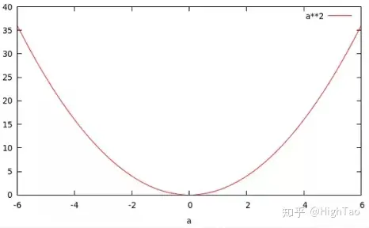

当你令a=2时，你将得到一个关于***b的[指数函数](https://www.zhihu.com/search?q=指数函数&search_source=Entity&hybrid_search_source=Entity&hybrid_search_extra={"sourceType"%3A"answer"%2C"sourceId"%3A470252492})\***，即 2b2^b2^b ：

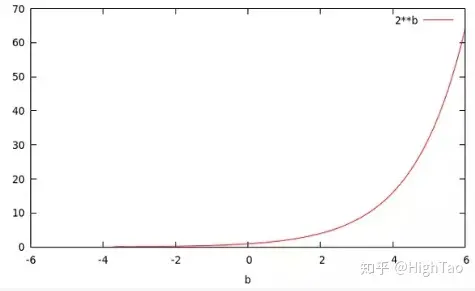

可以看到这两个函数有着不同的名字，却源于同一个函数。

而p(x|θ)也是一个有着两个变量的函数。***如果，你将θ设为常量，则你会得到一个概率函数（关于x的函数）；如果，你将x设为常量你将得到似然函数（关于θ的函数）\***。

下面举一个例子：

有一个硬币，它有θ的概率会正面向上，有1-θ的概率反面向上。θ是存在的，但是你不知道它是多少。为了获得θ的值，你做了一个实验：将硬币抛10次，得到了一个[正反序列](https://www.zhihu.com/search?q=正反序列&search_source=Entity&hybrid_search_source=Entity&hybrid_search_extra={"sourceType"%3A"answer"%2C"sourceId"%3A470252492})：x=HHTTHTHHHH。

无论θ的值是多少，这个序列的概率值为 θ⋅θ⋅(1-θ)⋅(1-θ)⋅θ⋅(1-θ)⋅θ⋅θ⋅θ⋅θ = θ⁷ (1-θ)³

比如，如果θ值为0，则得到这个序列的概率值为0。如果θ值为1/2，概率值为1/1024。

但是，我们应该得到一个更大的概率值，所以我们尝试了所有θ可取的值，画出了下图：

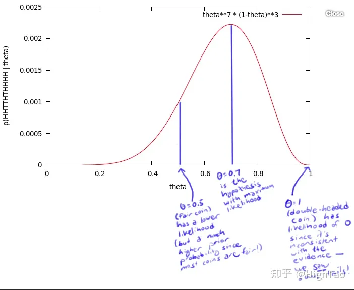

这个曲线就是θ的似然函数，通过了解在某一假设下，已知数据发生的可能性，来评价哪一个假设更接近θ的真实值。

如图所示，最有可能的假设是在[θ=0.7](https://www.zhihu.com/search?q=θ%3D0.7&search_source=Entity&hybrid_search_source=Entity&hybrid_search_extra={"sourceType"%3A"answer"%2C"sourceId"%3A470252492})的时候取到。但是，你无须得出最终的结论θ=0.7。事实上，根据[贝叶斯法则](https://www.zhihu.com/search?q=贝叶斯法则&search_source=Entity&hybrid_search_source=Entity&hybrid_search_extra={"sourceType"%3A"answer"%2C"sourceId"%3A470252492})，0.7是一个不太可能的取值（如果你知道几乎所有的硬币都是均质的，那么这个实验并没有提供足够的证据来说服你，它是均质的）。但是，0.7却是最大似然估计的取值。

因为这里仅仅试验了一次，得到的样本太少，所以最终求出的最大[似然值](https://www.zhihu.com/search?q=似然值&search_source=Entity&hybrid_search_source=Entity&hybrid_search_extra={"sourceType"%3A"answer"%2C"sourceId"%3A470252492})偏差较大，如果经过多次试验，扩充[样本空间](https://www.zhihu.com/search?q=样本空间&search_source=Entity&hybrid_search_source=Entity&hybrid_search_extra={"sourceType"%3A"answer"%2C"sourceId"%3A470252492})，则最终求得的[最大似然](https://www.zhihu.com/search?q=最大似然&search_source=Entity&hybrid_search_source=Entity&hybrid_search_extra={"sourceType"%3A"answer"%2C"sourceId"%3A470252492})估计将接近真实值0.5

链接：https://www.zhihu.com/question/54082000/answer/470252492

## 交叉熵

## 1. 最佳编码及编码成本（或代价）

话说某君鲍勃非常喜欢动物，他也经常和外地的朋友谈论动物。 假设他只说四个字：“狗”，“猫”，“鱼”和“鸟”，为了降低与朋友之间的通信费用（注：英文的每个字由多个字母构成，每个字母需要用一个字节即8比特来表示），他把这四个动物名编成二进制代码如下：

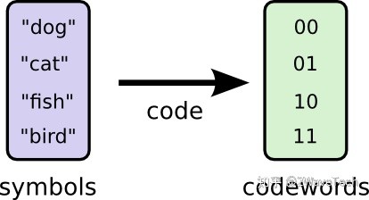

因为一共有4种动物，所以每一种动物用2位二进制的代码（即2比特）就完全表达了（ 22=4 )。每一个代码称为一个码字（codeword），它和一个动物名一一对应。这样每当他要告诉远方的朋友他要谈哪个动物时，他就只发送对应的码字。由于有一一对应的关系，所以在接收端，他的朋友知道如何解码，即把码字还原成动物名。显然，平均每个码字长为2比特。

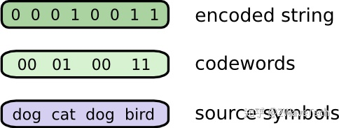

如果鲍勃非常喜欢“狗”，因而也谈论得多一些，其次他喜欢“猫”，再其次是”鱼“和”鸟“，也就是说，我们知道他每次和朋友交流时提到这四种动物名的频率是不一样的，频率越高的字出现的概率越大，如下图所示。 �(�) 就是动物名 � 在谈话中出现的概率。

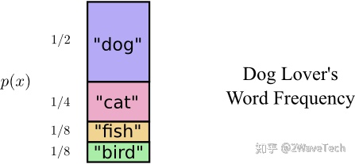

那么，我们是否可以利用这个信息来进一步压缩平均每个码字所需要的比特数呢？比如下面这个编码方案：

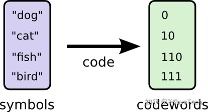

对于出现频率大的动物名，我们用尽量少的比特数来表示它，但必须保证不出现模棱两可的情况，即码字和动物名必须保持一一对应。我们发送的代码和码字如下：

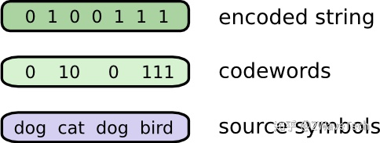

那么这个编码方案的平均每个码字的长度是多少呢？应该等于每个码字出现的概率乘上该码字的长度，再把所有的码字的这个乘积加起来，即计算它们的加权和。比如上例：

平均码字长 = 12×1+14×2+18×3+18×3=1.75 (比特)

这比第一个方案的平均码字长（ 2 比特）更短。

注意，制作出并非唯一可解码的编码方案是很有可能的。 例如，假设0和01都是码字，那么我们就不清楚编码字符串0100111的第一个码字是什么，因为可能是0，也可能是01。 我们想要的属性是，任何码字都不应该是另一个码字的前缀。 这称为前缀属性，遵守该属性的编码称为前缀编码。

## 2. 熵

考虑前缀属性的一种有用方法是，每个代码字都需要牺牲可能的码字空间。 如果我们使用码字01，则会失去使用其前缀的任何其它码字的能力。 比如我们无法再使用010或011010110，因为会有二义性。那么，当我们确定下来一个码字，我们会丢失多少码字空间呢？

以下图为例。01是我们选定的一个码字，以它为前缀的码字空间占整个码字空间的 1/4 ，这就是我们损失的空间，是我们选择2比特（01）作为码字的成本。其它码字只能用3比特或更多比特的编码了（如果需要编码的词多于4)。总的来说，如果我们选择长度为L 的码字，那么我们需要付出的代价就是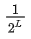

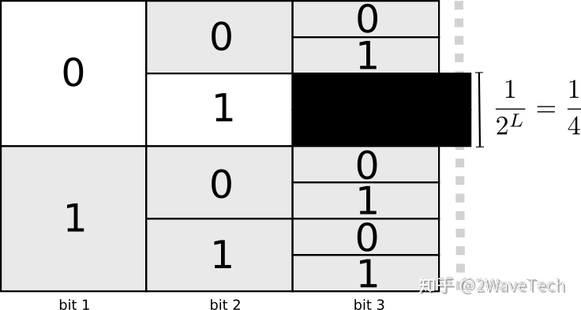

假设我们愿意为长度为 L 的代码付出的代价是cost ，那么， 

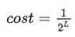

换算一下，长度 L 与付出的代价的关系是 

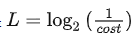

那么我们愿意或者说应该如何为不同长度的代码分配成本预算从而获得最短平均编码呢？有一种特别自然的方法可以做到这一点：根据事件的普遍程度来分配我们的预算。所以，如果一个事件发生了50%的时间，我们应该花费50%的预算为它买一个简短的代码。但是，如果一个事件只发生1%的时间，我们只花1%的预算，因为我们不太在乎代码是否长。

所以，为一个代码 x 分配的成本预算 cost 与该代码出现的概率 p(x) 成正比。我们就让cost 等于这个概率 p(x)  好了。这样，只要知道每个码字出现的概率而无需知道具体的编码方案，我们就可以计算编码的平均长度是：

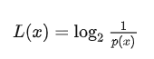

可以证明，这样的编码方法不仅是自然的，而且是**最佳的**。

这样，当每个码字 x 出现的概率是 p(x) ，那么最短的平均码字的长度是：

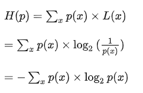

H(p) 就是熵！

大家可以用 H(p) 的公式验证一下第二个编码方案的熵就是1.75 bits。

我们从下图也可以直观地得到编码方案的熵，它就是图中各矩形的面积总和。可以看到，如果不用最佳编码，那么它的熵就比较大。

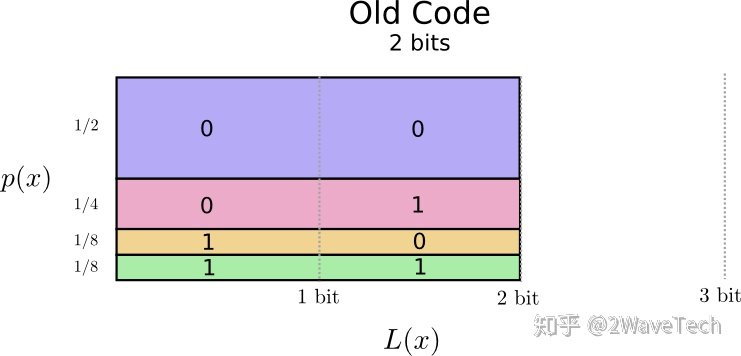

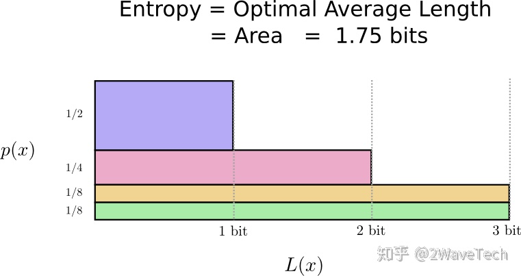

有关熵的意义还有其它多种解释。

在信息论里， −log2⁡p(x) 被信息论的创始人香农定义为事件x 的自信息，即一个概率为 p(x) 的事件 x 具有的信息量，单位是比特。熵就是所有事件的自信息的加权和，即这些事件的自信息的平均值。

熵也反应了这些事件的不确定度。熵越大，事件越不确定。如果一个事件的发生概率为1，那么它的熵为0，即它是确定性的事件。如果我们确定会发生什么，就完全不必发送消息了！结果越不确定，熵越大，平均而言，当我发现发生了什么时，我获得的信息就越多。

如果有两件事各以50％的概率发生，那么只需发送1比特的消息就够了。 但是，如果有64种不同的事情以相同的概率发生，那么我们将不得不发送6比特的消息(2的6次方等于64)。 概率越集中，我就越能用巧妙的代码编写出平均长度很短的消息。可能性越分散，我的信息就必须越长。

再举个例子。在决策树分类算法里，我们需要计算叶子节点的impurity（非纯洁度）。我们可以用熵来计算非纯洁度，而且比使用基尼指数计算更容易理解：一个叶子越纯，里面的分类越少，确定性越大，它的熵越小。如果一个叶子里的观察值都属于同一类，即它是完全纯的，那么这是一个确定性事件，它的概率等于1，所以它的熵为0。不纯的叶子的熵大于0。

## 3. 交叉熵

有某女爱丽丝不是爱狗而是个爱猫的人。她和鲍勃说相同的词，只是词的频率不同。 鲍勃一直在谈论狗，而爱丽丝一直在谈论猫。

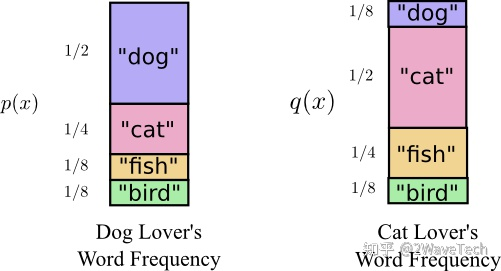

最初，爱丽丝使用鲍勃的代码发送消息。 不幸的是，她的信息比需要的更长。 Bob的代码针对其概率分布进行了优化。 爱丽丝的概率分布不同，因此代码不理想。 当鲍勃使用自己的代码时，一个码字的平均长度为1.75位，而当爱丽丝使用其代码时，则为2.25位。 如果两者不太相似，那就更糟了！

该长度（把来自一个分布q的消息使用另一个分布p的最佳代码传达的平均消息长度）称为交叉熵。 形式上，我们可以将交叉熵定义为：

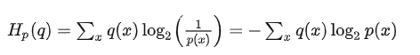

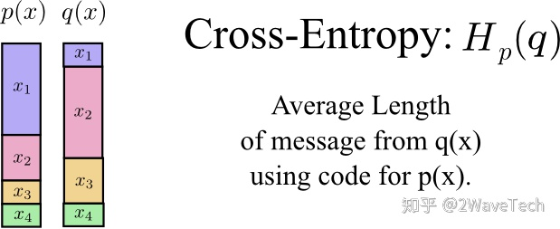

注意，交叉熵**不是对称的**。

那么，为什么要关心交叉熵呢？ 这是因为，交叉熵为我们提供了一种表达两种概率分布的差异的方法。p 和q的分布越不相同， p 相对于q 的交叉熵将越大于p 的熵。

## 4. KL散度

真正有趣的是熵和交叉熵之间的差。 这个差可以告诉我们，由于我们使用了针对另一个分布而优化的代码使得我们的消息变长了多少。 如果两个分布相同，则该差异将为零。 差增加，则消息的长度也增加。

我们称这种差异为Kullback-Leibler散度，或简称为**KL散度**。 p 相对 q 的KL散度可定义为：

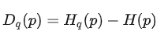

KL散度的真正妙处在于它就像两个分布之间的距离，即KL散度可以衡量它们有多不同！

https://zhuanlan.zhihu.com/p/115277553?utm_id=0
