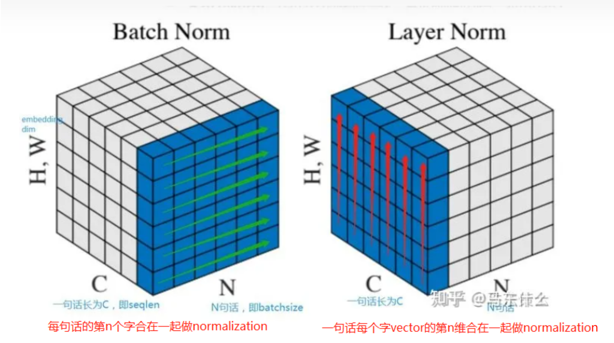
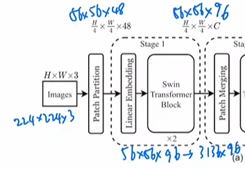
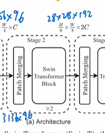
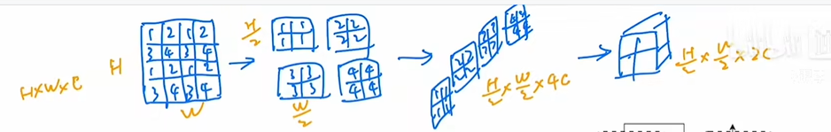
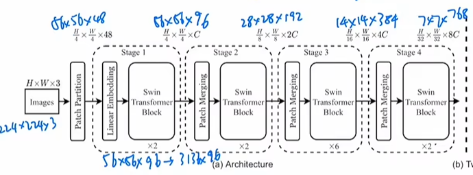

### Transformer

#### LB

训练深层网络时，由于批次的不断传入和训练，DNN内部参数在不断改变，导致每一次隐藏层的输入分布不一致，这不符合机器学习中的独立同分布假设(independent and identically distributed, IID)。也就是在训练过程中，隐层的输入分布老是变来变去，这就产生了内部协变量偏移问题(Internal Covariate Shift, ICS)。

Batch Normalization

        批归一化(Batch Normalization, BN)的提出就是解决ICS问题的，BN在batch上，对N、H、W做归一化，而保留通道 C 的维度。BN天然与batch size有关，batch size太小bn的效果不会太好，并且BN对于图像那样的固定尺寸的输入有效，对RNN这种输入时序列形式的网络效果不好，因为在类似图像中归一化的对象(同一个channel)大概率服从相似分布，而RNN归一化的对象(文本中同一位置出现的字或词)就很难服从相似分布了，所以就很难得到合适的均值和方差，将来自不同分布的特征做变换，不仅效果不好，甚至带来反作用。BN可以加速模型收敛，解决梯度弥散问题，且具有一定的正则化效果，一般用了BN的网络，就不需要再用Dropout等其他正则化方法了。

Layer Normalization

        如果我们将一批文本组成一个batch，那么BN的操作方向是，对每句话的第一个词进行操作。但语言文本的复杂性是很高的，任何一个词都有可能放在初始位置，且词序可能并不影响我们对句子的理解。而BN是针对每个位置进行缩放，这不符合NLP的规律，所以就提出了层归一化(Layer Normalization, LN)，LN则是针对一句话进行缩放的，且LN一般用在第三维度，如[batchsize, seq_len, dims]中的dims，一般为词向量的维度，或者是RNN的输出维度等等，这一维度各个特征的量纲应该相同。因此也不会遇到上面因为特征的量纲不同而导致的缩放问题。

Instance Normalization

        BN注重对batchsize数据归一化，但是在图像风格化任务中，生成的风格结果主要依赖于某个图像实例，所以对整个batchsize数据进行归一化是不合适的，因而提出了实例正则化(Instance Normalization, IN)。IN保留了N、C的维度，只在Channel内部对于H和W进行求均值和标准差的操作。IN适用于生成模型中，比如图片风格迁移。因为图片生成的结果主要依赖于某个图像实例，所以对整个Batch进行Normalization操作并不适合图像风格化的任务，在风格迁移中适用IN不仅可以加速模型收敛，并且可以保持每个图像实例之间的独立性。IN的计算就是把每个HW单独拿出来归一化处理，不受通道和batch_size 的影响如果特征图可以用到通道之间的相关性，那么就不建议使用它做归一化处理。
https://blog.csdn.net/tiancanucas/article/details/124783753

#### Swintransformer

##### 第一阶段

##### 第二阶段

