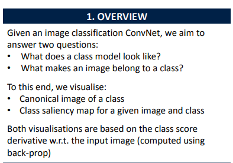
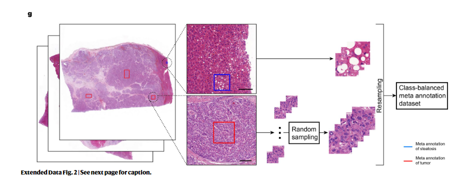

# 病理多模态

## 对比学习

### Deep learning supported discovery of biomarkers for clinical prognosis of  liver cancer

#### 简介

提出了一个可解释 DL 指导框架，称为 PathFinder

发现肝癌坏死的空间分布是一个长期被忽视的因素，与患者的预后有很强的关系。因此，我们提出了两个临床独立的指标，包括坏死面积分数和肿瘤坏死分布，用于实际预后，并根据肿瘤标志物预后研究的 R ep 或 ting R ec 推荐标准验证了它们在临床预后中的潜力。

一些研究验证了已建立的生物标志物和归因方法抽象风险评分的可信度，但是不能生成临床预后的新知识。

#### 解决的问题

前者包含多类组织的空间分布和相互作用信息，后者包含细胞结构和结构信息(方法和扩展数据图1)。然而，受到图形处理单元存储器和深度神经网络架构的限制，WSI 通常被切割成补丁，并且在大多数基于 DL 的研究中只关注微模式信息。

#### 亮点

使用 WSI 的稀疏的多类组织空间分布信息来评估预后和发现新的生物标志物。利用 WSI 的宏观模式，即低信息密度，完全匹配目前的空间定位属性方法，PathFinder 可以实现最先进的预测性能。

- 提出了两个临床独立的指标

  - 坏死面积分数(NEC)

  - 肿瘤坏死分布(TND)

- 并验证了NEC 和 TND 是否是**独立**的预后指标
- 甚至可以用作**复发预测的显着指标**
- 探讨如何从患者的**多个 WSI 中选择具有代表性的 WSI**
- 克服基于 DL 的风险评分的可解释性和普遍性有限的问题
- 病理学家挖掘主要生物标志物的**新工具**

#### 数据

癌症基因组图谱肝脏肝细胞性肝癌数据集(TCGA 数据集)

- 330个患者样本中收集了342个 WSI

北京清华长庚医院数据集(QHCG 数据集)

- 83个患者样本中收集了1182个 WSI

对于患者有多个 WSI 的情况，我们选择**肿瘤分数最大**的一个作为患者的代表性 WSI

本研究中使用的数据来自两个公开可用的数据集，TCGA 数据集和 PAIP 数据集以及 QHCG 数据集的内部数据集(补充图1和扩展数据图3a)。在 TCGA 数据集中，有330名患者的342个 WSI，每个 WSI 都有相应的临床信息。在 PAIP 数据集中，有100个 WSI，但没有可用的临床或生存信息。在 QHCG 数据集中，83例患者中有1182例 WSI 有临床信息，151例外部 WSI 无临床信息。在这项研究中，所有的 WSI 都在20倍的放大倍率下处理

#### 工作流

##### 宏观模式获取

训练多类组织分割网络 PaSegNet（cnn网络，获得七种常见肝组织的空间分布概率热图）

TUM, tumor; Nor, normal; FIB, fibrosis; INF, inflammation;  NEC, necrosis; REA, bile duct reaction; STE, steatosis; EMP, empty

TUM，肿瘤; 非正常; FIB，纤维化; INF，炎症; NEC，坏死; REA，胆管反应; STE，脂肪变性; EMP，空

不同层的同一位置为不同组织类型的概率，感觉就想图像的rgb一样

提出了**元注释**，一种**以数据为中心的注释方法**，结合病理学先验，弥合目前病理学注释方法与 DL 训练需求之间的差距

##### 预测深度神经网络训练

所获得的宏观模式和相应的**生存时间**被用作图像标签对来**训练** MacroNet（cnn+BN+MLP，），**输出**相应的**风险评分**来指导患者的预后

在 TCGA 数据集上对 MacroNet 进行了十倍交叉验证的培训，并在 QHCG 数据集上测试了经过训练的模型的普适性。

为了更好地比较 MacroNet 的预后性能，我们还设计和训练了 MicroNet 和 M2MNet 用于预后任务。前者基于微观模式，以高分辨率肿瘤贴片为输入，后者基于宏观模式和微观模式，试图融合这两种模式**（这里有点反常理）**

##### 新的生物标志物发现

###### method

将**归因算法**应用于训练有素、性能良好的 MacroNet 模型，以探索模型的空间焦点区域，从中得到潜在的预后生物标志物的启示

随后，这些**假设的生物标志物**以宏观模式为基础建模，以实现量化和角色塑造化，其中类似于可视化后的归因图的标志物被选为候选生物标志物，并用作多变量分析的指标。经过临床数据集的检验，可以确定明显独立的预后指标。

在宏观模型和归因图的综合分析的基础上，**病理学家可以提出模型所涉及的生物标志物的假设**，然后是定量的角色塑造。新的生物标志物的可视化与相应的归因图相似，根据**肿瘤标志物预后研究报告建议**的标准，被用作多变量分析的指标。经过临床数据测试，新的生物标志物显着独立的预后效果被发现

###### result

发现高贡献区域几乎是**坏死和其他组织的连接处**(图3b) ，这与我们以前从**全局角度**得出的结论是一致的。（全局角度：）

因此提出了两个临床独立的指标

- 坏死面积分数(NEC)
- 肿瘤坏死分布(TND)

发现这两个假设的指标可以很好地表征 MacroNet 关注的特征(图3b 和扩展数据图8) ，表明这两个临床可用的指标具有很大的潜力来影响 MacroNet 给出的风险评分的预后。

还应该指出的是：

- 这些生物标志物是客观和普遍的病理学特征，考虑到 NEC 是 WSI 的共同和固有属性
- TND 是考虑到肿瘤和坏死之间的**空间分布和相互作用**的**新设计的指标**

为了验证 NEC 和 TND 是否是独立的预后指标，通过对临床病理参数进行单变量和多变量分析，使用 Kaplan-Meier 曲线和 Cox 风险分析来研究这两个指标在 TCGA 和 QHCG 数据集上的预后意义。

Kaplan-Meier 曲线和 P 值显示 NEC 和 TND 可以显着区分 TCGA 和 QHCG 数据集上的高风险和低风险组(图4a，c，e，g)。

    
    

单因素和多变量分析显示，

总生存率依赖于：

NEC：

- QHCG 数据集

  - HR 4.66,95%
  - CI 1.77 ~ 12.28
  - P = 0.0019

- TCGA 数据集

  - HR 1.80,95%
  - CI 1.13 ~ 2.87
  - P = 0.0133

  

TND：

- QHCG 数据集

  - HR 6.67,95%
  - CI 2.36~18.85
  - P = 0.0003

- TCGA 数据集

  - HR 3.00,95%
  - CI 1.56~5.74
  - P = 0.0009

  

NEC和TND比大多数临床指标(包括 TIL)更为显著(图4b，d，f，h)。这表明，这两个指标是独立的其他临床病理特征。

    
    

将性能与已经被称为预后因素的肿瘤浸润淋巴细胞(TIL)进行比较

值得注意的是，Cox 比例风险模型能够在不使用额外的临床变量或 DL 方法预测的风险评分的情况下达到 C 指数0.7，因为它仅基于 NEC (C 指数0.703)或 TND (C 指数0.691)进行预测(图5d，e)。

此外，综合考虑其他临床因素，NEC 和 TND 的 C 指数可进一步提高至0.831和0.845，表明这两个指标在临床预后中的价值(补充图5)。**（这里我不是很理解，不应该是排除NEC 和 TND后看效果吗？）**

总的来说，上述结果证实了坏死的空间分布是预后的一个新的生物标志物。我们证明了基于 WSI 宏观模式的 AI 启发指标的预后性能与基于 WSI 微观模式、基因组学和多模态的各种 DL 模型的性能相当

##### 验证模型鲁棒性

在临床实践中，通常有许多来自患者的采样位置不同的 WSI (图5a)。由于微观模式**不受**取样位置的很大影响，在微观模式上训练的预后 DL 模型**很少讨论患者具有多个 WSIs的情况**。

NLP，非肿瘤性肝实质; TC，肿瘤中心; TI，肿瘤-肝界面; ANL，邻近非肿瘤性肝; RNL，远端非肿瘤性肝。

但不同的抽样位置将**导致宏观模式的巨大差异**，这将导致宏观网络预测的风险评分的偏差(图5b 和扩展数据图7e，f)。**探讨如何从患者的多个 WSI 中选择具有代表性的 WSI**，成为临床预后宏观指标应用中不可回避的问题

在我们以前的研究中，我们选择了**最大的肿瘤部分**作为患者的代表性 WSI。

为了探讨这种选择规则在临床预后中的稳健性和有效性，我们计算了所有 WSI 的风险评分，TND 和 NEC，并从患者的多个 WSI 中随机选择一个作为代表性 WSI，使用 C 指数来衡量预后的准确性在这个随机抽样标准下。

在随机选择策略下进行了10,000次模拟后，我们以前的选择规则的预后性能优于大多数随机选择(图5c，d，e)。

即使对于 NEC 和 TND 这两种客观和通用的生物标志物，**基于最大肿瘤分数选择规则的结果优于94%基于随机选择规则的结果**（为什么没有图？），表明 NEC 和 TND 生物标志物可以采用最大肿瘤分数选择规则进行临床预后。

此外，验证由不同精度的分割图计算出的这两个指标的预测鲁棒性也很重要。我们首先计算了由11个常用的卷积神经网络(CNN)产生的分割图对应的 TND 和 NEC 评分(扩展数据图9和10,补充说明2及补充图6及7)。

A，根据11个 CNN 产生的分割结果计算每个患者的 TND 评分。对应于 ResNeXt50(本研究中使用的 CNN)的 TND 评分用不透明的蓝色星号标记。患者根据对应于 ResNeXt50的 TND 评分进行排名。B，分类性能，分割结果，TND 热图，以及不同 CNN 的预后性能。直方图包括在 QHCG 测试集上测试的每个 CNN 的“肿瘤”类别的召回，精确度和 F1评分，以及基于每个 CNN 生成的分段图的 TND 预后表现(C-Index)。C，不同 CNN (n = 11个网络)的预测性能分布。箱形图晶须延伸到铰链四分位间距的1.5倍内的最小和最大值，箱形中心和铰链分别表示中位数和第一和第三四分位数。

然后我们测量相应的 NEC 和 TND 评分的预后表现(即 C 指数)。在由同一患者的不同 CNN 产生的分割结果计算的 TND 和 NEC 评分中没有发现重大差异，并且评分排名的总体趋势在所有患者中保持相对一致(扩展数据图9a 和10a)。更具体地说，**除了分类性能较差的 AlexNet 之外，从其他 CNN 生成的分段图获得的 TND 的 C 指数和NEC是接近的**。**这些结果说明了这两个指标对预后的稳健性**，进一步说明了它们在临床实践中的推广能力和可用性

##### 微观模式获取

只拿16个有肿瘤的patch

给rs分数

宏微观融合模式获取

#### 讨论

不使用 DL 来预测 WSIs的风险评分，而是侧重于提出以人为中心的工作流程，以激励病理学家从表现良好的黑盒中发现新的临床上可接受的生物标志物

探讨多类组织空间分布与预后之间的关系

输入更稀疏，具有明确的医学意义，这使得归因方法能够更准确地表征模型关注的生物标志物。

结果表明，即使从几 GB 的 WSI 减少到几 MB 的宏模式，DL 的预测性能仍然很好。这表明 WSI 的多类组织空间分布具有预后信息，预后 DL 模型的**常规输入是多余的**。

**准确的定位：**我们没有把 AI 作为病理学家的替代品，而是作为病理学家挖掘主要生物标志物的工具。

我们的研究结果表明，人工智能可以更客观地分析数据，并提醒我们的信息缺失。

同时，肿瘤与坏死之间的作用机制尚不清楚。TND 和 NEC 对预后的显著影响可能提示组织的空间分布是坏死机制研究中值得考虑的因素。此外，肿瘤坏死被认为是由**肿瘤坏死因子**引起的[35] ，这些因子**与 TILs有显着的相关性**。然而，我们的研究结果表明**肿瘤坏死与 TIL 之间的相关性较低**(扩展数据图6j，k) ，表明 HCC 坏死可能有其特定的原因和机制。

P 值根据two-sided log-rank test(a-f)和多变量 Cox 比例风险模型(g-i)。N，样本量; HR，风险比; 分期，AJCC 分期; TIL，肿瘤浸润性淋巴细胞数字评分; BDT，胆管血栓形成; AFP，α-胎儿蛋白; MVI，微血管浸润。

一个总结

作为知识发现的产物，TND 和 NEC 具有明显的病理学意义和明确的数学模型。在 TCGA 和 QHCG 数据集上评估了这些新的生物标志物的强大的普遍性，表明以人为中心的 AI 在知识发现和临床预后方面具有巨大的优势。与所有常用的 DL 模型一样，PathFinder 的聚焦特性会受到训练数据和超参数的影响。此外，宏观模式的个体内部变异性也不容忽视。然而，我们探讨了宏模式的鲁棒性，并给出了一个可行的宏模式可变性问题的选择规则。在 PathFinder 中，宏模式可以像微模式一样实现最先进的预测性能。考虑到许多研究已经在各种癌症类型中实现了多类组织分割[38,39] ，进一步探索这些现成的分割图对预后的影响可能会导致新的发现。

此外，得益于其简单易用的特征，PathFinder 可以**很容易地迁移到类似的任务，如空间多组学和三维病理预后**，以发现不同方式的新生物标志物。我们希望 PathFinder 作为一种基本机制，能够更好地整合临床预后和 AI 两个领域，并激发更多有意义的发现。

#### 为什么要做分割

为了更好的可视化？

#### 归因算法

为了探索性能良好的预测模型，有许多归因技术可以实现这样的工作，包括

基于梯度的方法

基于特征遮挡的方法

基于注意力权重的方法

然而，目前大多数的归因方法只能给出二维贡献空间位置的归因图，这可能不足以解释高信息密度的输入。

为了克服这一问题，并探讨宏观模式与预后的关系，我们将输入 WSI 解耦为**稀疏宏观模式**，并训练出高性能的宏观网络。

宏观模式只有组织的空间分布和相互作用信息，与现有归因技术产生的归因图匹配良好，宏观模式的信息极其稀疏和显性，使得解释更加客观和准确。

在这项工作中，我们使用**显着性图**，这是通过计算风险评分相对于输入像素^26^的损失函数梯度来生成的，结合 WSI 的分割图来实现解释。为了更好的可视化，我们将生成的显著性图中前30% 的值对应的透明度线性增加，并将显著性图与相应的分割图重叠。所发现的特征可以用来指导新的生物标志物的假设。

https://www.robots.ox.ac.uk/~vgg/publications/2014/Simonyan14a/poster.pdf

##### Saliency Maps的原理

**整体的目标** : 给一张图片*I_0*, 对应的分类是*c*, 有一个模型给出图片*I_0*的概率值是*S_c(I)*,我们想要衡量*I_0*的某个像素点对分类器*S_c(I)*的影响.

#### 算法详解

##### 元注释

###### 传统注释存在的问题

传统的 WSI 病理注释方法通常注释特定组织的轮廓，例如，肿瘤边界(扩展数据图2b)。

然而，由于边界复杂且规模庞大，对 WSI 进行注释既费时又费力。此外，组织边界总是包含难以通过注释排除的其他组织(扩展数据图2d) ，

这将把噪声标签数据引入 DL 训练集(扩展数据图2a)。

一些 WSI 区域完全由多种不能精确注释的组织类型混合(扩展数据图2e)。

此外，不同类型 WSI 的组织面积分数也有很大差异，例如，胆管反应组织可能占 WSI 组织面积的0.01% ，而肿瘤组织占60% 。另外，一个 WSI 中大面积的组织类型在内容上总是相似的，这是多余的(扩展数据图2f)。

这种**不平衡**的数据给 DL 训练带来了困难(扩展数据图2a)。

**大多数分割任务首先对斑块进行分类，然后根据斑块的空间分布进行拼接**，得到 WSI 的分割图。然而，**很难注释组织的连接**，并从组织边界给予一个特定的标记分割贴片。

###### 元注释的改进

元注释方法旨在保证注释组织的多样性，同时根据 WSI 的先验和病理学家的经验减少相似组织之间的冗余注释。

以下：

- 七种不同类型的组织和空区
  - TUM，肿瘤;
  - NOR，正常; 
  - FIB，纤维化; 
  - INF，炎症; 
  - NEC，坏死; 
  - REA，胆管反应; 
  - STE，脂肪变性; 
  - EMP，空
- 以及相同组织的不同亚型(例如，早期肿瘤与晚期肿瘤)

被认为是**intra-specific diversity**

在此分类的基础上，我们可以研究多类组织的宏观空间分布。

###### 细节

元注释的过程和 PaSegNet 数据集的获取用于分割显示在扩展数据图2g 中。

对于大肿瘤或正常区域，病理学家只注释内部区域的一小部分，并在多个空间区域进行采样，以确保数据的高度多样性和低相似性。对于那些只占据很小区域的组织类型，例如炎症和胆管反应，病理学家尽可能多地框出它们的区域。

对 WSI 进行注释后，基于注释矩形框自动提取150 × 150像素的非重叠区域。**虽然类不平衡的影响在注释过程中已经被最小化，但是 TUM 和 NOR 补丁仍然比 REA 和 INF 补丁频繁得多。**为了克服这个问题，在自动提取期间，我们指定 TUM 和 NOR 类基于一个 WSI 中的矩形注释进行多达**100个patches的随机提取**，并且以完整的补丁提取其他类的所有注释区域。通过对提取的数据集进行重采样，实现更好的类平衡，从而得到最终的元注释训练集

##### WSI 解耦和稀疏化

为了克服 WSI 信息密度高的问题，使预测 DL 模型更适合现有的归因方法，我们将输入 WSI 解耦为宏观模式和微观模式。

多类组织概率热图作为**宏观模式**

组织贴片的形态作为**微观模式**

(扩展数据图1)。

首先采用 OTSU 方法去除背景，将非背景区域分割成150 × 150RGB 图像块，在20倍放大倍数下记录所有块的位置。然后提出了一种基于 ResNeXt50的多类分类算法 PaSegNet fseg

##### negative Cox partial log-likelihood

###### Cox**比例风险模型**

Cox回归主要探讨什么样的患者死亡的更快，什么因素影响了患者死亡的速度。Cox回归分为单因素分析和多因素分析，分别探讨的是单个因素对于患者死亡的影响和多个因素对于患者死亡的影响。通常的做法是单个因素的影响比较显著时再将该因素用来多因素分析。Cox回归的公式如下：

h(t)是风险函数，风险函数是指在时间t时刻事件发生的概率，也就是说在t时刻之前患者都未死亡。 ℎ0(t) 是基准风险函数。 x1 .... x~n~是协变量，也就是我们的多因素分析中的每一个因素， β1 .... β~n~ 是变量前的系数，称为回归系数。这里通过极大似然法来估计回归系数。Cox回归的公式类似于一个广义线性回归。最后可以得到一个函数h(t),反应的是在若干个因素的影响下，t时刻患者死亡的概率。

https://zhuanlan.zhihu.com/p/347336671

让我们通过一个只有一个协变量的简化场景来解释模型系数的含义。让我们考虑一个风险因素`xᵢ`，例如吸烟，作为二元变量（0：非吸烟者*与*1：吸烟者）。Cox 模型可以表示为`h(t|xᵢ)= h₀(t)exp(βxᵢ)`，其中`exp(β)`表示吸烟相对于不吸烟引起的**不良事件的相对风险：**

- 吸烟带来的风险：
  `(xᵢ=1): h₀(t)exp(β⋅xᵢ) = h₀(t)exp(β⋅1) = h₀(t)exp(β)`
- 不吸烟带来的风险：
  `(xᵢ=0): h₀(t)exp(β⋅xᵢ) = h₀(t)exp(β⋅0) = h₀(t)`
- 相对风险 = 吸烟带来的风险 / 不吸烟带来的风险：
  `h₀(t)exp(β) / h₀(t) = exp(β)`

相对风险`exp(β)`（也称为**风险比**）是恒定的，不依赖于时间。

https://towardsdatascience.com/survival-analysis-optimize-the-partial-likelihood-of-the-cox-model-b56b8f112401

###### link function

而**生存符合泊松分布**（知道几年内死了几个，但不知道具体个体死亡概率）

因此，风险比值的对数与协变量之间呈线性关系：

因此上式可以作的link function：

Ri = { j | Yj ≥ Yi }是死亡时间或最后一次随访时间晚于患者 i 的患者的集合。

虽然label是生存时间，但是这个label跟平常的不一样，不直接用来计算。只是用这个label对样本进行排序。

比样本i生存时间长的所有样本风险分数作为求和作为分母，公式希望分母越小越好，分子越大越好。

##### 泊松分布

二项分布是知道个体事件发生概率

泊松分布是知道期望，但不知道个体事件发生概率（极小）

假设在一定时间间隔 (interval)中一个事件可能会发生0,1,2,...次，在一个间隔中平均发生事件的次数由λ决定，λ是事件发生的期望。在一定时间间隔中发生k次事件的概率如下：

https://www.zhihu.com/question/36214010

##### 泊松回归

###### 假设

泊松分布做出如下假设：

1. 任意相等时间间隔内，事件的平均出现次数是固定的
2. 任给的两次等待时间是否发生事件是相互独立的

如果我们按照普通的线性回归模型建模：

###### link function

具体来说，泊松回归的link function是：

广义线性模型包括可以将响应的预期值与模型中的线性预测变量相关联的链接函数。

###### 分布函数

则分布函数为：

x~i~就是不同属性需要输入的参数，用来拟合参数β

k~i~是观测值

λ=kp，

###### 似然函数

根据所有样本，我们计算出整个样本集的似然函数：

https://zhuanlan.zhihu.com/p/104494467

##### C-index

交叉验证一致性指数

##### Survival AUC

##### Kaplan-Meier 曲线

##### 对数秩检验

来测试高风险和低风险组之间的统计学差异

two-sided log-rank test

##### TIL abundance score

A novel digital score for abundance of tumour   infiltrating lymphocytes predicts disease free survival in oral   squamous cell carcinoma

https://www.nature.com/articles/s41598-019-49710-z.pdf

取决于肿瘤和淋巴细胞区域的共定位。在生态学中，不同物种的共定位被用来了解它们的群落结构35,36。TIL 区的肿瘤细胞和淋巴细胞在组织学上可以看作是两种不同的相互作用的物种我们认为 WSI 区域含有肿瘤和/或淋巴细胞和研究肿瘤和淋巴细胞共定位评分在 WSI 中的应用。

为此，将 WSI 划分为 m × n 等大的网格，使得区域分类器的网格大于输入补丁的大小。

其中 pijl 和 pijt 分别代表(i，j)网格细胞中淋巴细胞和肿瘤区域的百分比

如果一个网格细胞不包含任何肿瘤和淋巴细胞区域，那么它不会有助于共定位评分。

如果一个网格细胞只包含一种类型的区域，无论是肿瘤还是淋巴细胞，那么它只有助于方程的分母，从而导致一个相对较小的共定位评分值。

如果所有的网格单元只包含唯一类型的区域，那么共定位评分为零。这个评分范围从0到1，当每个网格细胞具有完全相同数量的肿瘤和淋巴细胞斑块时，评分是最大的

还可以小于0？