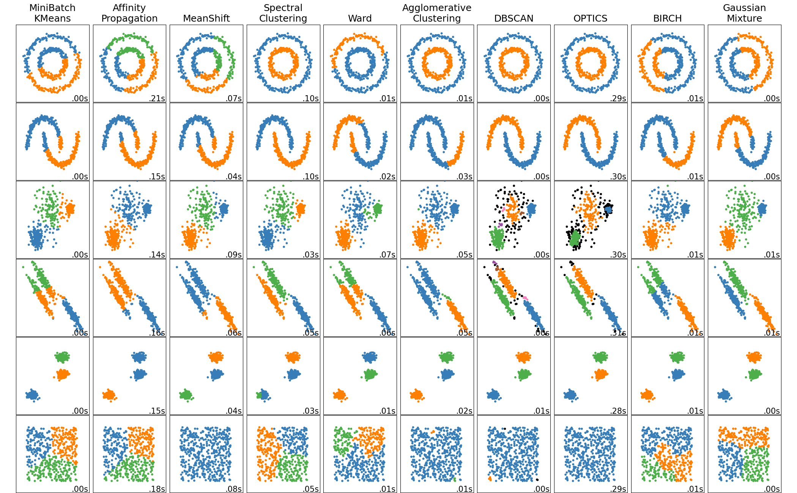

# Deep Cluster

## ECCV 2018

### Deep Clustering for Unsupervised Learning of Visual Features

https://arxiv.org/pdf/1807.05520.pdf

#### 概况


本文提出了一种端到端训练的无监督的视觉特征学习的方法. 传统的有监督的视觉特征学习的优化目标如下公式所示:


其中 f 是卷积网络, g 是多层感知分类器, x 是一个图片样本, y 是其对应的标签. 优化目标是最小化预测标签和真实标签之间的误差, 从而学习到视觉特征.

本文改进在使用 k 均值聚类的方法, 为每个样本分配一个标签, 从而实现无监督的端到端学习. 如下图所示, 对于卷积后生成的特征进行 k 均值聚类, 从而得到伪标签.
————————————————
https://blog.csdn.net/weipf8/article/details/105756217

#### 实现细节

**Convnet architectures.** For comparison with previous works, we use a standard AlexNet [54] architecture. It consists of five convolutional layers with 96, 256, 384, 384 and 256 filters; and of three fully connected layers. We remove the Local Response Normalization layers and use batch normalization [24]. We also consider a VGG-16 [30] architecture with batch normalization. Unsupervised methods often do not work directly on color and different strategies have been considered as alternatives [25,26]. We apply a fixed linear transformation based on **Sobel filters** to remove color and increase local contrast [19,39].

```java
 **Sobel filters：**

19：Bojanowski, P., Joulin, A.: Unsupervised learning by predicting noise. ICML (2017)

39：Paulin, M., Douze, M., Harchaoui, Z., Mairal, J., Perronin, F., Schmid, C.: Local convolutional features with unsupervised training for image retrieval. In: ICCV. (2015)
```

**Optimization.** We cluster the central cropped images features and perform data augmentation (random horizontal flips and crops of random sizes and aspect ratios) when training the network. This enforces invariance to data augmentation which is useful for feature learning [33]. The network is trained with dropout [62], a constant step size, an 2 penalization of the weights θ and a momentum of 0.9. Each mini-batch contains 256 images. For the clustering, **features are PCA-reduced to 256 dimensions, whitened and 2-normalized**. We use the k-means implementation of Johnson et al. [60]. Note that running k-means takes a third of the time because a forward pass on the full dataset is needed. One could reassign the clusters every n epochs, but we found out that our setup on ImageNet (updating the clustering every epoch) was nearly optimal. On Flickr, the concept of epoch disappears: choosing the tradeoff between the parameter updates and the cluster reassignments is more subtle. We thus kept almost the same setup as in ImageNet. We train the models for 500 epochs, which takes 12 days on a Pascal P100 GPU for AlexNet.

## CVPR 2020

### Online Deep Clustering for Unsupervised Representation Learning

https://arxiv.org/pdf/2006.10645.pdf

#### 背景

DC(Deep Clustering)在训练时交替进行“聚类”与“网络学习”，在无监督表示学习领域达到了很好的效果，但**其学习过程是不稳定的**

这主要是由于DC的**离线学习机制**，在不同的epoch中样本标签发生改变，导致网络学习不稳定。


#### 概况

为了解决这个问题，本文提出了ODC(Online Deep Clustering)的在线学习机制，同步执行“聚类”与“学习”而不是交替，这能保证分类器稳定更新的同时，簇心也稳步演变。通过使用两个存储器memory来实现，一个sample memory存储样本特征与标签，另一个centroids存储簇中心特征。
————————————————
https://blog.csdn.net/qq_36560894/article/details/114455070


## AAAI-2021

### Contrastive Clustering

本文提出了一种称为对比聚类（CC）的单阶段在线聚类方法，该方法采用实例级和聚类级的对比学习。具体来说，对于给定的数据集，正实例对和负实例对是通过数据扩充构建然后投影到特征空间中。其中，实例级和聚类级对比学习分别在行和列空间中进行，通过最大化正对的相似性，最小化负对的相似性进行对比聚类。得出的结论为，特征矩阵的行可以被视为实例的软标签，相应地，列可以被视为聚类表示。通过同时优化实例和聚类级对比损失，该模型以端到端的方式联合学习表示和聚类分配。

#### 问题背景

大部分聚类算法在复杂数据集上的表现都很差
大部分深度聚类方法无法满足在线聚类需求

#### 拟解决问题

现有的大部分深度聚类算法需要迭代进行表示学习和聚类这两个过程，利用聚类结构来优化表示，再对更优的表示进行聚类，迭代聚类的过程中容易出现误差累计（联合优化）
聚类过程通常采用k-means等需要全局相似性的算法，使得需要数据全部准备好后才能进行聚类工作，故面临不能处理在线数据的局限性

#### 联合优化的应用

A Deep Neural Network for Unsupervised Anomaly Detection and Diagnosis in Multivariate Time Series Data（AAAI-2019） MESCRED 时间序列异常检测，对异常检测、异常原因识别、异常严重程度进行联合处理
Learning Representations for Incomplete Time Series Clustering （AAAI-2021）CRLI 不完整时间序列聚类，将不完整时间序列补全和表示学习进行联合优化
Contrastive Clustering 本文做到了将表示学习和聚类进行联合优化

#### 主要贡献

基于“标签即表示”的思想，即特征矩阵的行和列本质上分别对应于实例和集群表示，将聚类任务统一到表示学习框架下，对每个样本学习其聚类软标签作为特征表示
该方法不仅在实例层面上进行对比学习，而且在聚类层面上进行对比学习，这种双重对比学习框架可以产生聚类偏好表征
该模型采用单阶段、端到端的工作方式，只需批量优化，因此可以应用于大规模数据集，并且该方法可以在不访问整个数据集的情况下及时预测每个新数据点的聚类分配，适合在线场景
————————————————
https://blog.csdn.net/qq_43923588/article/details/123647811

## CVPR 2022

### DeepDPM: Deep Clustering With an Unknown Number of Clusters

#### 狄利克雷过程（DP）

# Traditional Cluster



## AP(affinity propagation)聚类算法

### 简介

**仿射传播聚类算法、近邻传播聚类算法、亲和传播聚类算法**

​	Affinity Propagation聚类算法简称AP， 是基于数据点间的”信息传递”的一种聚类算法。算法的基本思想是将全部样本看作网络的节点，然后通过网络中各条边的消息传递计算出各样本的聚类中心。聚类过程中，共有两种消息在各节点间传递，分别是吸引度( responsibility)和归属度(availability) 。AP算法通过迭代过程不断更新每一个点的吸引度和归属度值，直到产生m个高质量的Exemplar（类似于质心），同时将其余的数据点分配到相应的聚类中。

### 步骤简述

①输入一组相似度，一般取相似度的中位数作为preference参数

②计算R和A。计算R时，R值确定k适合作为i的聚类中心的程度。R--先从i到k找出最适合作为i的聚类中心的点。（第一次循环时，到点i距离最近的点最适合作为i的聚类中心）  A--计算其他点对R中找出的那些相对适合的点被选作聚类中心的支持程度的总和。受支持的R值置为零。最后用R(i,i)+A(i,i)>0来衡量点i是否可以作为聚类中心，若超过规定的迭代次数点i依旧是可以的或循环次数超过规定的最大循环次数，便可以跳出循环。

③由对于满足 r(i,i)+a(i,i)>0 的数据点，作为类的exemplars.
来找出聚类中心点，再在S中寻找这些聚类中心的归属点。
https://blog.csdn.net/qq_38195197/article/details/78136669

### 详细聚类过程

关于此算法的详细聚类过程，我们则以以下数据进行演示：
假设我们现在有如下样本，共5个维度：

Table1：PreferencesofFiveParticipants

Participant	Tax Rate	Fee	Interest Rate	Quantity Limit	Price Limit
Alice	3	4	3	2	1
Bob	4	3	5	1	1
Cary	3	5	3	3	3
Doug	2	1	3	3	2
Edna	1	1	3	2	3
相似度矩阵（Similarity Matrix）
相似度矩阵中每个单元是用两个样本对应值的差的平方和取负值得到的，对角线上的除外。
例如这里我们来计算一下 Alice 和 Bob 的相似度：
( 3 − 4 ) 2 + ( 4 − 3 ) 2 + ( 3 − 5 ) 2 + ( 2 − 1 ) 2 + ( 1 − 1 ) 2 = 7

如上所述，他们之间的相似度是 -7 。
最后，我们得到如下结果：

Participant	Alice	Bob	Cary	Doug	Edna
Alice	0	-7	-6	-12	-17
Bob	-7	0	-17	-17	-22
Cary	-6	-17	0	-18	-21
Doug	-12	-17	-18	0	-3
Edna	-17	-22	-21	-3	0
当聚类中心为对角线上的单元格选择了比较小的值，那么AP算法会快速收敛并得到少量的聚类中心，反之亦然。因此。我们使用表格中最小的值 -22 去填充相似度矩阵中的 0 对角线单元格。

Table2：SimilarityMatrix

Participant	Alice	Bob	Cary	Doug	Edna
Alice	-22	-7	-6	-12	-17
Bob	-7	-22	-17	-17	-22
Cary	-6	-17	-22	-18	-21
Doug	-12	-17	-18	-22	-3
Edna	-17	-22	-21	-3	-22
吸引度矩阵（Responsibility Matrix）
一开始我们构造一个全为 0 的矩阵作为初始 归属度矩阵（Availability Matrix），接下来使用如下公式计算每一个 吸引度矩阵（Responsibility Matrix） 中的单元格的值：
$$
r ( i , k ) ← s ( i , k ) − max ⁡ k ′ ≠ k { a ( i , k ′ ) + s ( i , k ′ ) }
$$
其中： i 和 k 分别表示对应矩阵中的行、列索引。

举个栗子：现在我们来计算 Bob(column) 对 Alice(row) 的 吸引度（Responsibility），这里套用上面的公式即为：用 Bob(column) 对 Alice(row) 的 相似度（Similarity） 为 -7 减去 Alice 这一行除了 Bob 对其它人相似度的最大值 -6，结果为 -1 。
那么我们很快便可得到如下吸引度矩阵：

Table3：ResponsibilityMatrix

Participant	Alice	Bob	Cary	Doug	Edna
Alice	-16	-1	1	-6	-11
Bob	10	-15	-10	-10	-15
Cary	11	-11	-16	-12	-15
Doug	-9	-14	-15	-19	9
Edna	-14	-19	-18	14	-19

#### 归属度矩阵（Availability Matrix）

接下来我们使用一个独立的式子去更新 归属度矩阵 中的 对角线 上的单元格而不是直接删除：
$$
a ( k , k ) ← ∑ max ⁡ i ′ ≠ k { 0 , r ( i ′ , k ) }
$$
其中： i 和 k 分别指矩阵中的行、列索引。

表示自我归属度（**看k对其他样本的吸引程度是怎么样的**，该列的正数多，就说明k对其他样本的吸引程度大，适合做聚类中心）

实际上这个公式计算的是除了指定行以外对应列所有单元格值大于 0 的总和。比如现在我们要得到 Alice 的自我归属度，只需要将除了 Alice 那行的 自我吸引度值除外的当列所有值加和即可：10+11+0+0=21


接下来的式子用于计算 非对角线 单元格的归属度：
$$
a ( i , k ) ← min ⁡ ({ 0 , r ( k , k ) + ∑ max ⁡ i ′ ∉ { (i , k) } { 0 , r ( i ′ , k ) } })
$$
**表示k自己想做自己聚类中心的程度+k对其他样本的吸引程度**


在这里同样的我们来举个例子：

求a(Cary,Edna) ：

r(Edna,Edna)=−19 ，求和项 max(0,r(Alice,Edna))+max(0,r(Bob,Edna))+max(0,r(Doug,Edna))=0+0+9=9 

a(Cary,Edna)=min(0,−19+9)=−10 。
同理，a(Doug,Bob)=min(0,−15+0+0+0)=−15 。


我们可以得到如下归属度矩阵：

Table4：AvailabilityMatrix

Participant	Alice	Bob	Cary	Doug	Edna
Alice	21	-15	-16	-5	-10
Bob	-5	0	-15	-5	-10
Cary	-6	-15	1	-5	-10
Doug	0	-15	-15	14	-19
Edna	0	-15	-15	-19	9
评估矩阵（Criterion Matrix）
评估矩阵中的单元格值是由对应位置的归属度值和吸引度值相加而得：
$$
c ( i , k ) ← r ( i , k ) + a ( i , k )
$$
例如：c(Bob(column),Alice(row))=−1+−15=−16 。
那么我们可以得到如下评估矩阵：

Table5：CriterionMatrix

Participant	Alice	Bob	Cary	Doug	Edna
Alice	5	-16	-15	-11	-21
Bob	5	-15	-25	-15	-25
Cary	5	-26	-15	-17	-25
Doug	-9	-29	-30	-5	-10
Edna	-14	-34	-33	-5	-10


我们一般将评估矩阵中取得最大值的一些点作为聚类中心（这些点可能又多个行组成），比如在我们这个例子中， Alice，Bob 和 Cary 共同组成一个聚类簇，而 Doug 和 Edna 则组成了第二个聚类簇。
在实践中，我们一般会在训练模型前将不同量纲的特征进行归一化（因为归根结底当前算法比较依赖样本之间的距离）。
https://blog.csdn.net/june_young_fan/article/details/127572638

### 算法优点

1）不需要制定最终聚类个数；

2）将已有数据点作为最终的聚类中心，而不是新生成聚类中心；

3）模型对数据的初始值不敏感，多次执行AP聚类算法，得到的结果是完全一样的，即不需要进行随机选取初值步骤（还是对比K-Means的随机初始值）；

4）对初始相似度矩阵数据的对称性没有要求；

5）与k中心聚类方法相比，其结果的平方差误差较小，相比于K-means算法，鲁棒性强、准确度较高，但算法复杂度高、运算消耗时间多。

# trick
